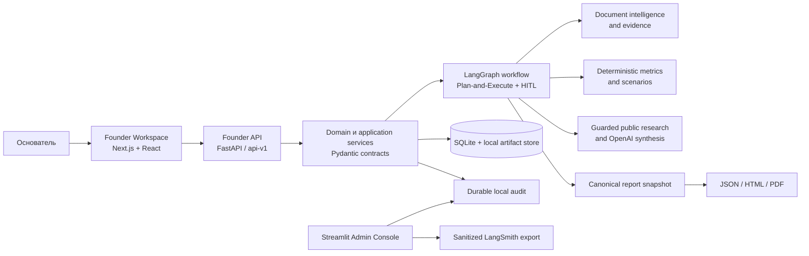

# Founder Intelligence: платформа, архитектура, MVP и следующий этап

**Статус документа:** обзор текущего GitHub-релиза на 31 августа 2026 года

**Текущий профиль поставки:** локальный `sales_ready_hybrid` / Profile B

Founder Intelligence — локальная evidence-led платформа для анализа стартапа по материалам основателя. Она превращает PDF, DOCX, таблицы, изображения, безопасные ZIP-архивы и ответы пользователя в один версионируемый кейс: профиль проекта, метрики, рыночные ориентиры, риски, вопросы, сценарии, план улучшений и итоговый отчёт.

В старых технических документах репозитория встречается рабочее название **Founder Launch Intelligence**. В пользовательском интерфейсе и текущей публичной документации используется название **Founder Intelligence**.

Платформа не является инвестиционной рекомендацией, автоматической оценкой стоимости компании или готовым production SaaS. Текущий результат — проверяемый локальный MVP для одного основателя, консультанта или проверяющего.

## 1. Какую проблему решает платформа

У основателя часто есть бизнес-план, презентация и отдельные цифры, но нет единой структуры анализа. Обычный чат с LLM может написать убедительный текст, однако не гарантирует, что выводы отделены от предположений и привязаны к источникам.

Founder Intelligence решает эту задачу иначе:

- начинает с документов, а не с хорошего промпта;
- показывает, что подтверждено, заявлено, рассчитано или пока неизвестно;
- задаёт один следующий вопрос, который сильнее всего улучшит анализ;
- применяет публичный research только после явного согласия;
- не превращает AI-синтез или рыночный ориентир в частный факт компании;
- сохраняет решения пользователя и отчёт в рамках одного `caseId`;
- формирует JSON, HTML и PDF из одной утверждённой версии отчёта.

## 2. Путь пользователя

1. Основатель создаёт новый анализ и загружает материалы проекта.
2. Система безопасно разбирает файлы и строит первичный профиль продукта.
3. Пользователь проверяет понимание проекта и проходит Gate 2 кнопкой `Подтвердить и продолжить`.
4. Case Copilot предлагает один главный вопрос или следующее действие.
5. Пользователь отвечает вручную, добавляет документ, разрешает публичный поиск либо оставляет пробел открытым.
6. Система пересчитывает применимые метрики, сценарии, рынок, риски и рекомендации.
7. Пользователь принимает направление либо меняет допущения — это решение Gate 3.
8. В разделе отчётов пользователь фиксирует финальную версию через Gate 4.
9. Из одной утверждённой версии становятся доступны JSON, HTML и PDF.

Точные названия кнопок и полный reviewer journey приведены в [GITHUB_REVIEWER_GUIDE_RU.md](../GITHUB_REVIEWER_GUIDE_RU.md).

## 3. Архитектура

### Основные поверхности

| Компонент | Ответственность |
| --- | --- |
| Founder Workspace | Русскоязычный Next.js-интерфейс для загрузки, анализа, Copilot, решений и отчётов |
| Founder API | Версионированные FastAPI-контракты `/api/v1`, жизненный цикл кейса и доступ к артефактам |
| Domain/Application Core | Evidence, provenance, метрики, риски, сценарии, privacy-политики и отчётные правила |
| LangGraph workflow | Последовательность анализа, параллельные ветки, ограниченная Reflexion и Human-in-the-Loop gates |
| Case Copilot | Вопросы, ответы, допущения, research jobs, сценарии и улучшения одного кейса |
| Streamlit Admin Console | Трассы, privacy, retries, cost/latency, целостность и связь case/run/report |
| Local persistence | SQLite, локальный artifact store и именованный Docker volume |
| Reporting | Канонический snapshot и производные JSON, HTML и PDF |

Frontend не является источником бизнес-логики: он показывает данные и состояния, полученные через API. Канонические расчёты, provenance и решения gates остаются в Python-слое.

## 4. Использованные технологии

| Область | Технологии |
| --- | --- |
| Backend | Python `>=3.12,<3.14`; Docker runtime на Python 3.13; FastAPI; Uvicorn; Pydantic 2 |
| Оркестрация | LangGraph и SQLite checkpoints; Plan-and-Execute; bounded Reflexion; HITL Gates 2–4 |
| AI и research | OpenAI SDK; структурированные ответы; budget/retry guards; отдельный адаптер публичного research |
| Обработка файлов | PyMuPDF, pdfplumber, python-docx, openpyxl, Pillow, pandas и DuckDB |
| Хранение | SQLite, content-addressed local artifact store и локальный audit spool |
| Отчёты | Jinja2, WeasyPrint, ReportLab fallback, Matplotlib и Plotly |
| Founder UI | Next.js 16, React 19, TypeScript 5, App Router и Lucide icons |
| Admin | Streamlit |
| Observability | Durable local audit, OpenTelemetry и санитизированный LangSmith exporter |
| Упаковка | `uv`, npm, отдельные backend/frontend Dockerfile и Docker Compose |
| Проверки | pytest, Ruff, mypy, frontend contract tests, TypeScript и ESLint |

Live AI и LangSmith являются опциональными внешними контурами. Без пользовательских ключей система может работать в детерминированном offline-режиме, не выдавая offline fixtures за реальный интернет-поиск.

## 5. Что уже сделано

| Возможность | Текущее состояние |
| --- | --- |
| Универсальная загрузка | Поддержаны PDF, DOCX, PNG/JPEG, CSV/XLSX и безопасный ZIP |
| Первичный анализ | Профиль продукта, клиента, проблемы, монетизации, стадии и пробелов |
| Case Copilot | Один приоритетный вопрос; ручной ответ, документ, публичный поиск или `Не знаю` |
| Онлайн и offline research | Явное согласие, отдельные режимы, sanitized query, сохранение публичных источников и безопасная деградация |
| Метрики и сценарии | Детерминированные формулы, диапазоны, зависимости, confidence и validation plan |
| Рынок и риски | Рыночные ориентиры, конкуренты, пробелы, противоречия и список проверок |
| План улучшений | Главная ставка, приоритетные действия и принятие либо изменение допущений |
| Human-in-the-Loop | Gate 2 для подтверждения профиля, Gate 3 для решения по направлению, Gate 4 для фиксации отчёта |
| Отчётность | Связанные с одним кейсом JSON, HTML и PDF |
| Admin и tracing | Локальный audit, граф workflow, privacy-состояние, ошибки, cost/latency и sanitized LangSmith metadata |
| Docker | Сервисы `api`, `web` и опциональный `admin`, общий volume с кейсами |
| GitHub reviewer package | Безопасные env-примеры, Docker-инструкция, fixtures и автоматические release-smoke проверки |

Формальный контракт `founder_capabilities.v1` уже помечает `universal_upload`, `primary_startup_analysis` и `public_comparable_analysis` как `available`. Отдельные части глубокого анализа работают в текущем workflow и UI, но полная возможность `deep_startup_analysis` пока намеренно остаётся со статусом `planned` до отдельной продуктовой приёмки этого контракта.

## 6. Что является MVP

Текущий MVP — это **локальный reviewer-ready продукт Profile B**:

- desktop-first Founder Workspace;
- один локальный оператор и локальные кейсы;
- Founder API, Founder Workspace и опциональная Admin Console;
- same-case journey от загрузки до PDF;
- собственные OpenAI/LangSmith ключи пользователя для live-функций;
- offline-режим для воспроизводимой проверки без затрат;
- явные privacy, consent и provenance-границы;
- сохранение данных в локальном Docker volume;
- исходники, тесты, fixtures без секретов и документация в GitHub.

MVP доказывает основной продуктовый цикл: **материалы → структурированный анализ → уточнения → решение пользователя → проверяемый отчёт**.

## 7. Что не входит в MVP

Текущая версия не заявляет:

- production multi-tenant SaaS;
- регистрацию, authentication, RBAC и рабочие пространства организаций;
- облачную PostgreSQL persistence и object storage;
- durable background jobs и распределённую очередь;
- billing, subscriptions и коммерческий кабинет;
- production backup/restore, SLO, autoscaling и круглосуточные operations;
- мобильный интерфейс;
- объективную оценку стоимости стартапа или инвестиционную рекомендацию;
- полноту рынка без доступных live-источников и проверки человеком.

## 8. Provenance и безопасность данных

Платформа хранит разные типы значений раздельно:

| Тип | Значение |
| --- | --- |
| `source_fact` | Факт извлечён из допустимого документа или другого eligible evidence |
| `founder_statement` | Заявление основателя, которое ещё требует проверки |
| `public_benchmark` | Публичный ориентир с источником и датой |
| `deterministic_calculation` | Расчёт по формуле с явными зависимостями |
| `ai_scenario` | Сценарий или синтез AI, а не подтверждённый факт |
| `contradiction` | Зафиксированный конфликт между утверждениями или источниками |

`founder_statement`, `public_benchmark` и `ai_scenario` не повышаются автоматически до `source_fact`.

Публичный research может искать рынок, конкурентов, цены, категории и внешние аналоги. Он не заполняет приватные показатели компании: revenue, MRR/ARR, cash, burn, количество клиентов, договоры, счета, банковские остатки и другие внутренние данные. Они принимаются только от основателя или из загруженных документов и сохраняют соответствующий provenance.

В LangSmith разрешён только санитизированный контур наблюдаемости. Raw-документы, их текст, локальные пути, имена файлов, системные инструкции, PII и секреты не должны попадать во внешний trace. Durable local audit остаётся локальным источником воспроизводимости.

## 9. Известные ограничения MVP

- Live AI и онлайн-research требуют интернета и собственных ключей пользователя.
- Offline-demo воспроизводит безопасный сценарий интерфейса, но не является доказательством актуального интернет-исследования.
- Неполный или противоречивый документ приводит к gaps и снижению confidence, а не к искусственно полному ответу.
- Данные хранятся локально; изоляция нескольких организаций пока не реализована.
- Текущий интерфейс рассчитан на desktop-проверку; mobile находится за границей MVP.
- Production deployment и эксплуатационные гарантии должны быть реализованы в следующем профиле.

## 10. Следующий этап: Profile C — pilot-ready платформа

Следующий этап не меняет ядро анализа. Он переводит проверенный локальный workflow в управляемую многопользовательскую среду.

### 10.1. Identity и tenancy

- authentication и trusted principal;
- роли основателя, консультанта и оператора;
- workspaces, membership и tenant isolation;
- audit действий пользователя и политики доступа к кейсам.

### 10.2. Production data plane

- PostgreSQL вместо локальных repository adapters;
- object storage для документов и отчётов;
- шифрование, lifecycle/retention policies;
- проверяемые backup и restore.

### 10.3. Durable execution

- очередь фоновых analysis/research/report jobs;
- retry, resume, cancellation и idempotency;
- ограничения параллелизма и бюджетов;
- безопасная деградация внешних провайдеров.

### 10.4. Delivery и operations

- CI/CD и воспроизводимые окружения;
- secrets management;
- rate limits, SLO и operational dashboards;
- централизованные sanitized traces, alerts и cost controls;
- security review и threat model перед пилотом.

### 10.5. Product pilot

- controlled pilot с реальными основателями и консультантами;
- измерение времени до полезного отчёта и доли закрытых gaps;
- набор эталонных кейсов и регулярные evaluations;
- формальная приёмка `deep_startup_analysis` и обновление capability-контракта;
- решение о мобильной версии, коммерческой упаковке и billing после результатов пилота.

Критерий завершения Profile C: несколько организаций могут безопасно работать со своими кейсами, длительные задачи переживают перезапуск, отчёт и audit имеют проверяемую lineage, а эксплуатационные риски контролируются без изменения аналитических правил MVP.

## 11. Где продолжить

- Запуск проекта: [README.md](../README.md)
- Пошаговый путь проверяющего: [GITHUB_REVIEWER_GUIDE_RU.md](../GITHUB_REVIEWER_GUIDE_RU.md)
- Каноническое описание продукта: [PRODUCT.md](../PRODUCT.md)
- Граница Profile B → Profile C: [2026-08-12-sales-ready-hybrid-boundaries.md](architecture/2026-08-12-sales-ready-hybrid-boundaries.md)
- Формальный capability-контракт: [`capabilities.py`](../src/due_diligence_agent/application/product/capabilities.py)
