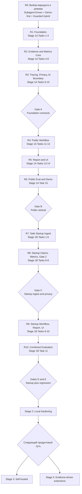

# Investment Due Diligence Agent Delivery Roadmap Implementation Plan

> **For agentic workers:** REQUIRED SUB-SKILL: Use superpowers:subagent-driven-development (recommended) or superpowers:executing-plans to implement this plan task-by-task. Steps use checkbox (`- [ ]`) syntax for tracking.

**Goal:** Провести проект от утверждённой архитектуры до проверенного Local MVP с Public Company и Startup режимами, не переходя к следующей стадии без короткого QA, пакета доказательств и подтверждения владельца.

**Architecture:** Этот документ является управляющим roadmap поверх двух подробных implementation-планов. Он фиксирует критический путь, точки остановки, пользовательские выборы и обязательные Gate A–E; точные файлы, тесты и коммиты остаются в планах Stage 1A и Stage 1B.

**Tech Stack:** Python 3.12, uv, Pydantic 2, LangGraph, OpenAI Responses API/Code Interpreter behind DataEgressPolicy, deterministic MetricEngine, SEC EDGAR, SQLite, DuckDB, FAISS, OpenTelemetry, durable JSONL audit, sanitized LangSmith, Streamlit, Plotly/Matplotlib, Jinja2, WeasyPrint/ReportLab, pytest, Ruff, mypy, Ragas offline diagnostics.

## Global Constraints

- Источник истины: [утверждённая дизайн-спецификация](../specs/2026-08-09-investment-due-diligence-agent-design.md).
- Детальный Stage 1A: [Public Company Local MVP](2026-08-09-public-company-local-mvp.md).
- Детальный Stage 1B: [Startup Data-Room Local MVP](2026-08-09-startup-data-room-local-mvp.md).
- Notion-страница не считается подтверждённым источником, пока доступ остаётся заблокирован OAuth/API ошибкой `403`.
- Stage 1A выполняется раньше Stage 1B; Startup-разработка не начинается до зелёного Gate B и фиксации shared contracts.
- LangGraph workflow не начинается до Gate A; Startup LangGraph не начинается до Gate C.
- Privacy, tracing, audit и evaluation являются blocking requirements, а не дополнительным polish.
- Канонические финансовые метрики считает только детерминированный `MetricEngine`; LLM и Code Interpreter создают лишь предварительные гипотезы и артефакты для повторной проверки.
- Базовый путь local-first должен работать с frozen fixtures без живой сети и без обязательной отправки документов внешнему LLM.
- Любая стадия завершается коротким локальным QA, пакетом доказательств и статусом `На проверке`; следующая стадия остаётся `Приостановлено` до явного подтверждения пользователя.
- Roadmap не является разрешением автоматически выполнять все стадии подряд.
- Календарные сроки оцениваются только после выбора режима исполнения, AI-профиля и optional parser stack; до этого используется количество задач и относительный размер.

---

## 1. Текущий статус

| Элемент | Статус | Что требуется |
|---|---|---|
| Архитектурная спецификация | `Утверждено` | Изменения только через явное решение |
| Stage 1A implementation plan | `R3 в работе` | R2 утверждён владельцем 2026-08-10; выполняются только Tasks 9–10 и Gate A |
| Stage 1B implementation plan | `Готов` | Заблокирован до Gate B |
| Delivery roadmap | `Утверждено` | Последовательность R0–R13 принята владельцем 2026-08-09 |
| Decision D0 | `Утверждено` | `1. Subagent-Driven`; выбрано владельцем 2026-08-09 |
| Decision D1 | `Утверждено` | `A. Demo-first`; выбрано владельцем 2026-08-09 |
| Decision D2 | `Утверждено` | `A. Guarded hybrid`; выбрано владельцем 2026-08-09 |
| Roadmap R1 | `Утверждено` | Владелец разрешил продолжение 2026-08-09 |
| Roadmap R2 | `Утверждено` | Владелец принял реализацию и результаты проверок 2026-08-10 |
| Roadmap R3 | `В работе` | Tasks 9–10: tracing, privacy и governed AI boundary |
| Roadmap R4–R10 | `Приостановлено` | Не начинать до Gate A и последующих подтверждений |
| Stage 2–4 | `Отложено` | Вернуться после Gate E и анализа eval-данных |

## 2. Правило перехода между стадиями

Каждый переход использует один и тот же контракт:

1. Завершить только текущую стадию.
2. Выполнить указанный mini-QA локально с ограниченным временем.
3. Сохранить результаты тестов, hashes, отчёты или trace/audit evidence.
4. Показать пользователю короткий отчёт: что готово, что не готово, риски, ссылки на артефакты.
5. Перевести текущую стадию в `На проверке`, следующую оставить `Приостановлено`.
6. Продолжить только после явного подтверждения пользователя.

Тяжёлые live-network проверки не заменяют mini-QA и запускаются отдельно, когда они действительно нужны.

## 3. Карта поставки



## 4. Сводный roadmap

| ID | Стадия | Детальные задачи | Относительный размер | Выходной результат | Жёсткая стоп-точка |
|---|---|---:|---:|---|---|
| R0 | Выбор маршрута | Управленческое решение | XS | Зафиксированный профиль исполнения | Подтверждение пользователя |
| R1 | Foundation | Stage 1A Tasks 1–3 | 3 задачи | Locked Python project, shared domain contracts, repositories, content-addressed storage | Foundation mini-QA |
| R2 | Evidence and Metrics Core | Stage 1A Tasks 4–8 | 5 задач | Evidence Ledger, SEC/market/news adapters, retrieval index, deterministic metrics | Data/evidence mini-QA |
| R3 | Tracing, Privacy, AI Boundary | Stage 1A Tasks 9–10 | 2 задачи | Durable audit, OTel, sanitized LangSmith, DataEgressPolicy, OpenAI gateway | Gate A |
| R4 | Public Workflow | Stage 1A Tasks 11–12 | 2 задачи | Resumable Plan-and-Execute, risk/market/financial nodes, Reflexion, HITL | Graph mini-QA |
| R5 | Report and UI | Stage 1A Tasks 13–14 | 2 задачи | Canonical JSON/HTML/PDF, charts, CLI, Streamlit | Report/UI mini-QA |
| R6 | Public Eval and Demo | Stage 1A Task 15 | 1 задача | Frozen public dataset, reproducible public demo | Gate B |
| R7 | Safe Startup Ingest | Stage 1B Tasks 1–5 | 5 задач | Archive safety, parsers, spreadsheets, local redaction/no-network baseline | Security/parser mini-QA |
| R8 | Startup Claims, Metrics, Disclosure | Stage 1B Tasks 6–8 | 3 задачи | Claim–evidence matrix, startup metrics, Gate 2 approval | Gate C |
| R9 | Startup Workflow, Report, UI | Stage 1B Tasks 9–10 | 2 задачи | Resumable Startup graph and complete report/UI | Startup e2e mini-QA |
| R10 | Combined Evaluation | Stage 1B Task 11 | 1 задача | Frozen startup dataset and Public+Startup regression evidence | Gates D and E |
| R11 | Local hardening | Spec Stage 2 | XL, уточняется | Более устойчивый продукт на грязных данных | Hardening acceptance |
| R12 | Self-hosted | Spec Stage 3 | XL, отдельный plan | Multi-user service deployment | Отдельное архитектурное утверждение |
| R13 | Extensions | Spec Stage 4 | По одной гипотезе | Расширения, подтверждённые eval-данными | Отдельный ROI/eval gate |

`XS/XL` — только относительная сложность. Основной измеритель до выбора режима — число независимо проверяемых задач.

## 5. Детальный порядок Stage 1A

### R1 — Foundation

**Статус:** `Утверждено` владельцем 2026-08-09. Реализация находится в `feature/stage1a-public-demo`; implementation HEAD — `14cca59906e92668950b107163942f3625b6ce36`. В основную ветку не объединена.

**Цель:** получить стабильный shared core, на котором последующие агенты не будут создавать несовместимые сущности.

**Включает:**

- Python 3.12, `uv.lock`, explicit dependency groups;
- `DueDiligenceCase`, `Artifact`, `EvidenceFact`, `Calculation`, `Finding`, `Contradiction`, `Approval`, `ReportSnapshot`, `NodeResult`;
- repository ports, SQLite metadata, content-addressed artifact storage.

**Нельзя параллелить до фиксации контрактов:** доменные схемы, repository interfaces, ID/value-object conventions и snapshot schema.

**Mini-QA:** unit tests доменных моделей и integration tests локального storage.

**Результат для проверки:** schema inventory, storage smoke, `uv.lock` hash, список зафиксированных интерфейсов.

**Фактические доказательства R1:**

- полный `pytest`: 30 тестов пройдено; Ruff и mypy пройдены;
- `uv lock --check --python 3.12`: пройден; SHA-256 `uv.lock` — `143665CA729D638F8AD457283FB40E21854B0F57285755FBA864546409583B34`;
- канонический runtime: Python 3.12.13; полный Stage 1A import smoke — `stage1a ok`; compatibility smoke Python 3.13 — `py313 stage1a ok`;
- WeasyPrint 69.0 и Pango 15802 подтверждены на Windows;
- schema inventory: `cases`, `artifacts`, `evidence_facts`, `calculations`, `findings`, `contradictions`, `approvals`, `report_snapshots`, `workflow_checkpoints`;
- зафиксированы repository interfaces для case, artifact, evidence, calculation, finding, contradiction, approval и report;
- независимый broad review: spec, quality и security — PASS; замечаний нет;
- Task 4+ не реализовывались.

### R2 — Evidence and Metrics Core

**Статус:** `Утверждено` владельцем 2026-08-10. Tasks 4–8 завершены в `feature/stage1a-public-demo`; implementation HEAD — `d2f3ebc4285849aab150dec4ca3e43ba184fc077`, review handoff — `33420e5ac265db6e704fefb4a0fb6fcc2edcb706`. Владелец разрешил переход к R3.

**Цель:** доказать работу с фактами и числами до добавления сложного LLM-поведения.

**Включает:**

- Evidence Ledger и source-priority rules;
- SEC EDGAR primary adapter и immutable HTTP cache;
- secondary market/news adapters с provenance/licensing flags;
- offline filing parsing, local retrieval index;
- deterministic public-company metrics.

**Допустимая параллельность после R1:** SEC adapter, secondary sources и MetricEngine могут разрабатываться отдельными lanes, но объединяются только через утверждённые ports и evidence schema.

**Mini-QA:** contract fixtures для источников, retrieval fixture test, golden metric calculations.

**Kill criteria:** критический financial finding без primary evidence или несовместимые units/periods блокируют переход.

**Фактические доказательства R2:**

- полный `pytest`: 169 тестов пройдено; SEC cache/adapter contract: 46 тестов; MetricEngine: 20 тестов, включая 13 golden-метрик;
- Ruff, mypy и `uv lock --check --python 3.12` пройдены; lockfile разрешает 193 пакета;
- канонический runtime Python 3.12.13 и изолированный offline compatibility smoke Python 3.13.14 прошли полный Stage 1A import-набор с настроенным `WEASYPRINT_DLL_DIRECTORIES`;
- Evidence Ledger привязан к case/artifact boundary; fixture-backed market/news collectors не имеют публичного обхода manifest verification;
- SEC cache привязан к provider/version/query/as-of/license/URL request context, exact payload key и fail-closed symlink checks для normal, stale и existing-key путей;
- retrieval остаётся локальным и offline: metadata-only index, content-addressed text references, allowlisted model manifest и FAISS sidecar integrity;
- MetricEngine детерминированно считает 13 публичных метрик и различает истинно отсутствующие входы, несовместимые периоды, units, denominators и as-of;
- независимые spec, security, code-quality и test-adequacy проверки завершились `APPROVE`; R2-блокеров и открытых gaps нет;
- локальный review package: `.superpowers/sdd/2026-08-09-public-company-local-mvp/r2-review-package.md`.

**Стоп-точка пройдена:** владелец утвердил R2 2026-08-10. Tracing, OpenTelemetry, sanitized LangSmith, DataEgressPolicy и OpenAI gateway выполняются отдельно в R3/Tasks 9–10.

### R3 — Tracing, Privacy, AI Boundary

**Статус:** `В работе` с 2026-08-10. Разрешены только Tasks 9–10 и Gate A; Task 11 остаётся приостановленным до отдельного подтверждения владельца.

**Цель:** создать управляемую AI-границу до LangGraph и любых внешних вызовов.

**Включает:**

- durable local JSONL audit как канонический журнал;
- OpenTelemetry spans и correlation IDs;
- non-blocking exporter fallback;
- sanitized LangSmith adapter;
- `DataEgressPolicy`, disclosure scopes, privacy-safe tool payloads;
- budget guard;
- OpenAI Responses/Code Interpreter adapter с provisional outputs и обязательной MetricEngine recheck.

**Почему tracing здесь:** если добавить его после workflow, невозможно доказать полноту трассировки, privacy boundary и корректность exporter-outage behavior без переделки графа.

**Gate A QA:**

```powershell
uv run --no-default-groups --group stage1a --group stage1a-rag-local --group dev pytest tests/unit/domain tests/integration/storage tests/unit/evidence tests/unit/observability tests/privacy tests/contract/test_foundation_gate.py -v
```

**Gate A pass:** shared contracts, audit, trace sanitizer, egress boundary и repositories зелёные; privacy leak count равен `0`.

**Стоп:** Stage 1A Task 11 не начинается до подтверждённого Gate A.

### R4 — Public Workflow

**Цель:** собрать resumable Plan-and-Execute над уже проверенными deterministic services.

**Включает:**

- shared `AnalysisPlan`/`PlanStep`;
- Public LangGraph checkpoints и retry policy;
- Financial, Risk и Market nodes;
- bounded Reflexion, максимум две итерации;
- HITL Gates 1, 3 и 4.

**Mini-QA:** graph branch tests, checkpoint restart, stale-approval invalidation, contradiction pause/resume.

**Kill criteria:** graph state содержит raw documents вместо IDs, Reflexion неограничен или resume меняет результат.

### R5 — Report and UI

**Цель:** дать пользователю проверяемый результат, а не только внутренний pipeline.

**Порядок:** сначала canonical `ReportSnapshot` и JSON, затем HTML/PDF renderers, потом CLI и Streamlit surface.

**Включает:**

- common и Public report sections;
- deterministic charts;
- Jinja2/WeasyPrint и проверенный ReportLab fallback;
- report preview, Evidence Ledger, contradictions, HITL inbox и sanitized trace summary в UI.

**Mini-QA:** JSON/HTML/PDF hashes, `%PDF` signature, template sanitization, Gate 4 rejection path, application boot smoke.

### R6 — Public Eval and Demo

**Цель:** доказать, что Public vertical воспроизводим и готов для демонстрации.

**Gate B QA:**

```powershell
uv run --no-default-groups --group stage1a --group stage1a-rag-local --group eval-ragas --group dev ruff check .
uv run --no-default-groups --group stage1a --group stage1a-rag-local --group eval-ragas --group dev mypy src
uv run --no-default-groups --group stage1a --group stage1a-rag-local --group eval-ragas --group dev pytest --cov=due_diligence_agent --cov-report=term-missing
```

**Gate B evidence package:**

- `eval-result.json`;
- Public Report JSON, HTML и PDF;
- sanitized audit JSONL;
- runtime/model/dependency manifest и hashes;
- checkpoint-recovery proof;
- exporter-outage proof;
- полный Ruff/mypy/pytest output.

**Решение пользователя после Gate B:** принять Public demo и перейти к Startup либо сначала сделать ограниченный polish Public UX. Stage 1B всё равно остаётся обязательной частью утверждённого полного MVP, если scope не изменён отдельно.

## 6. Детальный порядок Stage 1B

### R7 — Safe Startup Ingest

**Entry condition:** Gate B зелёный, shared contracts зафиксированы.

**Включает:**

- изолированные dependency groups;
- archive inspection, zip-slip/bomb protection, quarantine;
- PDF/DOCX/image parsers и optional OCR;
- XLSX/CSV normalization с cell-level evidence;
- sensitivity classification, redaction и parser no-network guard.

**Базовая стратегия:** light parsers являются обязательным Gate C baseline. Tesseract, Presidio и Docling включаются только после отдельных smoke gates и не блокируют базовую поставку.

**Mini-QA:** archive safety, parser fixtures, spreadsheet locators, redaction, forbidden-string scan.

### R8 — Startup Claims, Metrics, Disclosure

**Включает:**

- Startup claim extraction и sensitivity-filtered retrieval;
- claim–evidence matrix и first-class contradictions;
- ARR, MRR, margin, burn, runway, CAC/LTV/churn/NRR metrics при наличии входов;
- HITL Gate 2 с default-deny disclosure policy.

**Gate C QA:**

```powershell
uv run --no-default-groups --group stage1b-light-ingest --group stage1a-rag-local --group dev pytest tests/security/test_archive_safety.py tests/parsing/test_document_parsers.py tests/parsing/test_spreadsheets.py tests/privacy/test_startup_redaction.py tests/integration/retrieval/test_startup_retrieval.py tests/graph/test_startup_disclosure_gate.py tests/privacy/test_ai_egress.py tests/unit/observability -v
```

**Gate C pass:** unsafe inputs заблокированы/изолированы, network attempts отсутствуют, restricted chunks не попадают во внешний context, Gate 2 default-deny, privacy leak count `0`.

**Стоп:** Startup graph не начинается до подтверждённого Gate C.

### R9 — Startup Workflow, Report, UI

**Включает:**

- resumable Startup LangGraph;
- Financial, Risk и Market analysis nodes;
- bounded Reflexion и HITL Gates 2, 3, 4;
- Startup report sections;
- data-room inventory, claim matrix, startup metrics и report preview в Streamlit.

**Mini-QA:** graph pause/resume, Gate 2 zero-call denial, checkpoint recovery, immutable report snapshot, draft/final export behavior.

### R10 — Combined Evaluation

**Цель:** доказать Startup vertical и отсутствие регрессий Public режима.

**Gate D:** synthetic SaaS dataset, четыре planted contradictions, golden calculations, retrieval recall, report completeness и latency.

```powershell
uv run --no-default-groups --group stage1b-light-ingest --group stage1a-rag-local --group eval-ragas --group dev pytest tests/evaluation/startup tests/e2e/test_startup_case_e2e.py tests/e2e/test_startup_report.py -v
```

**Gate E:** общий lint/typecheck/test regression gate.

```powershell
uv run --no-default-groups --group stage1b-light-ingest --group stage1a-rag-local --group eval-ragas --group dev ruff check .
uv run --no-default-groups --group stage1b-light-ingest --group stage1a-rag-local --group eval-ragas --group dev mypy src
uv run --no-default-groups --group stage1b-light-ingest --group stage1a-rag-local --group eval-ragas --group dev pytest --cov=due_diligence_agent --cov-report=term-missing
```

**MVP completion evidence:** Gate C/D/E results, approved Startup report artifacts, claim–evidence matrix, deterministic calculation records, zero-leak proof, no-network proof, denial zero-call proof, checkpoint recovery и combined regression output.

## 7. После Local MVP

### R11 — Stage 2: Local hardening

Рекомендуемый следующий обязательный слой:

- больше parser fixtures и повреждённых документов;
- OCR confidence/quality controls;
- расширение metrics только по подтверждённым данным;
- улучшение claim–evidence UX;
- caching/resume hardening;
- budget, latency и trace-health dashboards.

Для Stage 2 создаётся отдельная спецификация и отдельный implementation plan после анализа Gate E evidence.

### R12 — Stage 3: Self-hosted

Возможный путь после hardening:

- FastAPI + Next.js;
- Postgres/pgvector;
- MinIO/S3;
- workers;
- OIDC/RBAC;
- OTel Collector + Grafana;
- multi-user audit и retention.

Этот этап нельзя начинать как перенос текущего кода «один к одному». Сначала утверждаются tenancy, security, retention, deployment и operational SLO.

### R13 — Stage 4: Evidence-driven extensions

Только после появления измеримых eval gaps или product demand:

- multi-agent consortium;
- social/news sentiment;
- market-size research agent;
- дополнительные filing systems и юрисдикции;
- альтернативные LLM providers;
- углублённый legal/document risk analysis.

Каждое расширение получает собственную гипотезу, dataset, evaluator, бюджет и kill criteria.

## 8. Варианты после утверждения roadmap

### Decision D0 — Режим исполнения

**Выбрано:** `1. Subagent-Driven` — отдельный исполнитель на каждую задачу с review между задачами. Решение зафиксировано 2026-08-09; выполнение ещё не начато.

| Вариант | Когда подходит | Компромисс |
|---|---|---|
| `1. Subagent-Driven` — рекомендован | Нужны независимые исполнители и review между задачами | Выше качество и throughput, больше координации |
| `2. Inline Execution` | Нужен один последовательный контекст | Проще контроль, ниже параллельность |

### Decision D1 — Темп поставки

**Выбрано:** `A. Demo-first` — сначала R1–R6 и отдельная приёмка Public Company demo после Gate B; R7–R10 остаются на паузе до подтверждения владельца. Решение зафиксировано 2026-08-09; выполнение ещё не начато.

| Вариант | Маршрут | Что получает пользователь первым |
|---|---|---|
| `A. Demo-first` — рекомендован | R0 → R6 → review → R7–R10 | Проверяемый Public Company demo после Gate B |
| `B. Full-MVP continuous` | R0 → R10 с обязательными остановками на gates | Оба режима, но первый внешний demo позже |

### Decision D2 — AI connectivity profile

**Выбрано:** `A. Guarded hybrid` — deterministic local core остаётся каноническим; redacted external LLM разрешается только через approval, `DataEgressPolicy`, budget guard и sanitized tracing. Решение зафиксировано 2026-08-09.

| Вариант | Поведение | Риск/стоимость |
|---|---|---|
| `A. Guarded hybrid` — рекомендован | Deterministic local core + redacted external LLM после approval | Лучшее качество synthesis при контролируемом egress |
| `B. Local/fixture-first` | Внешние вызовы выключены до отдельного решения | Максимальная конфиденциальность, меньше AI-возможностей |

### Decision D3 — Startup parser profile

| Вариант | Состав | Рекомендация |
|---|---|---|
| `A. Light baseline` | PDF/DOCX/XLSX/CSV/image validation | Обязательный Gate C baseline |
| `B. Baseline + Tesseract` | Добавляет локальный OCR | После binary/quality smoke |
| `C. Extended` | Tesseract + optional Presidio/Docling | После offline model/dependency gates |

### Decision D4 — Путь после Gate E

| Вариант | Цель | Рекомендация |
|---|---|---|
| `A. Local hardening` | Надёжность на реальных грязных документах | Рекомендуемый следующий шаг |
| `B. Self-hosted` | Multi-user deployment | После hardening и отдельной security spec |
| `C. Extensions` | Новые AI-функции | Только по eval/product evidence |

### Runtime HITL decisions — отдельно от delivery gates

Delivery Gates A–E проверяют готовность продукта и открывают переход между стадиями разработки. Runtime HITL Gates 1–4 срабатывают внутри каждого due-diligence кейса:

| Runtime gate | Решение пользователя |
|---|---|
| Gate 1 — Scope confirmation | Подтвердить компанию, режим, `as_of`, набор источников и границы анализа |
| Gate 2 — Disclosure policy | Разрешить только показанный redacted scope либо оставить кейс в local deterministic mode |
| Gate 3 — Critical contradictions | Принять resolution, запросить дополнительные данные или оставить unresolved |
| Gate 4 — Report freeze | Утвердить immutable snapshot для финального PDF либо вернуть draft на доработку |

Эти runtime-решения не являются одноразовыми архитектурными выборами: пользователь принимает их отдельно для каждого кейса и каждого report snapshot.

## 9. Что допускается параллелить

После R1 и только через утверждённые interfaces:

- SEC adapter и secondary market/news adapters;
- MetricEngine и retrieval implementation;
- отдельные report renderer tests;
- fixture generation и evaluator scaffolding после стабилизации schemas.

Нельзя параллелить через незакрытую зависимость:

- LangGraph nodes до фиксации domain/ports/repositories;
- OpenAI gateway до DataEgressPolicy, audit и trace sanitizer;
- Startup core до Gate B;
- Startup graph до Gate C;
- финальный PDF до Gate 4 freeze;
- self-hosted migration или extensions до Gate E, если это не явно обозначенный throwaway prototype.

## 10. Definition of Done для полного Local MVP

- Public Company и Startup режимы проходят frozen offline datasets.
- Critical evidence coverage и required report sections равны `100%`.
- Golden financial calculations совпадают; LLM не является источником канонических цифр.
- Privacy leakage равна `0` во внешних payloads, traces, tools, logs и reports.
- Trace completeness равна `100%`; exporter outage не ломает workflow, local audit сохраняется.
- Reflexion ограничен двумя раундами.
- HITL Gates 1–4 корректно pause/resume и инвалидируют устаревшие approvals.
- JSON/HTML/PDF строятся из одного immutable `ReportSnapshot`.
- Checkpoint recovery доказан для обоих workflow.
- Полный Ruff, mypy и pytest regression gate зелёный.
- Все limitations и disclaimers задокументированы.

## 11. Следующее действие после проверки этого roadmap

D0 выбран: `1. Subagent-Driven`. D1 выбран: `A. Demo-first`. D2 выбран: `A. Guarded hybrid`. D3 требуется только перед Startup Stage 1B; D4 — только после Gate E. R1 и R2 утверждены владельцем. Выполняется только R3 (Tasks 9–10) с обязательными task review и Gate A mini-QA; R4 и Task 11+ остаются `Приостановлено`. Merge не выполняется до отдельного указания.
