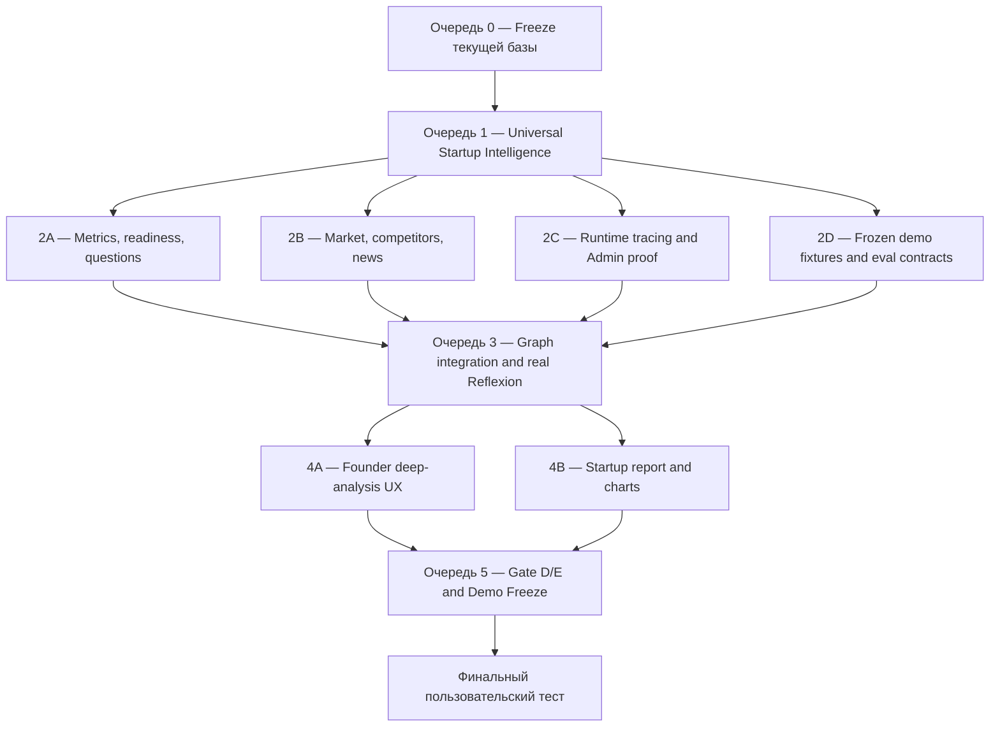

# Capstone N3 — лестница завершения до продаваемого демо

**Дата сверки:** 2026-08-13  
**Ветка:** `main`
**Цель:** довести текущий Founder Launch Intelligence до проверяемого Sellable Demo по разделу 34 продуктового ТЗ, не смешивая это с последующими Pilot-Ready и Production-Ready стадиями.

## 1. Где находится проект сейчас

Исходный roadmap нельзя читать как простую линейную шкалу: часть более поздней инфраструктуры была реализована раньше, чем была закончена доменная аналитика.

| Roadmap stage | Текущее состояние | Краткий вывод |
|---|---|---|
| R0 — Spec Lock | Закрыт | ТЗ, профиль B и архитектурные границы зафиксированы. |
| R1 — Baseline Freeze | Закрыт | Public Company foundation и Gate B существуют как regression baseline. |
| R2 — Product Experience Shell | Закрыт | Founder Workspace и Admin Console визуально разделены. |
| R3 — Safe Startup Ingest | Закрыт для offline/frozen scope | Активный startup flow и Gate C покрывают PDF, DOCX, PNG, JPEG, CSV, XLSX и safe ZIP, включая partial/damaged поведение и privacy. |
| R4 — Startup Intelligence Core | Закрыт для offline/frozen scope | Persisted `StartupProfile v1`, deterministic primary analysis, API/report binding и restart-equivalence подтверждены полным regression и Gate C/D/E. |
| R5 — Metrics & Guided Readiness | Закрыт в Queue 2 | Автоматический pack selection, evidence-backed calculations, readiness и максимум три adaptive questions подключены к startup workflow/report. Controlled Python остаётся отдельным default-off opt-in seam. |
| R6 — Market Intelligence | Frozen/offline scope закрыт в Queue 2 | Competitors, TAM/SAM/SOM, source/as-of и dated sentiment подключены к startup graph/report через frozen provider. Реальный live research остаётся отдельной будущей интеграцией. |
| R7 — Startup Orchestration | Закрыт в Queue 3 для frozen/offline scope | LangGraph, checkpoints, retries, Gates 2–4, bounded Reflexion, budget guard и явные Document Intelligence/Product Validation/GTM boundaries проверены. GTM snapshot reference-only, restart-safe, перестраивается после Gate 3 и доступен через frozen founder-safe API/query contract. |
| R8 — Founder Product & Reports | Закрыт в Queue 4 для offline/frozen scope | Canonical Startup Profile, GTM/Action Plan, 12 основных секций canonical report, report-derived Readiness/deep questions, deterministic startup charts и browser-visible Gate 4 с JSON/HTML/PDF показаны в реальном Founder browser flow. |
| R9 — Admin Console | Local proof закрыт в Queue 2 | Локальный audit, graph nodes, retries/errors, token/cost, report lineage и exporter degradation видны через bounded DTO. Внешняя доставка LangSmith/OTel остаётся optional production scope. |
| R10 — Demo Freeze | Частично | Gate D/E contracts и Queue 2 closure evidence готовы; финальный повторный Gate B/C/D/E packet, screenshots и сценарий защиты остаются Queue 5. |
| R11 — Pilot Hardening | Отложен | Не нужен для capstone demo. |
| R12 — Self-Hosted Production | Отложен | Не нужен для capstone demo; требует отдельной auth/tenancy/security спецификации. |

**Текущая рабочая точка (обновлено 2026-08-15):** Queue 2 закрыта для frozen/offline scope после поэлементного аудита и функциональной верификации через commit `759482f8760f71eec6395ffffbc9ac2b9265d8d8`. Queue 3 также закрыта для frozen/offline scope: Critic/Arbiter (`9fb987d`), controlled budget exhaustion (`a039e4d`), Document Intelligence/Product Validation (`71d95b6`), deterministic GTM contract (`0b315a2`), graph integration (`43052ba`) и финальная API/query/report-lineage freeze (`54230a8`, `dbf8a98`, `4f72d0b`) прошли TDD и независимый review. Queue 4 закрыта для frozen/offline scope шестью проверенными границами: canonical GTM/Action Plan (`412ab16`, `28af637`), canonical Startup Profile (`d0b95a0`, `808493a`), founder-safe canonical report sections (`c55d0f7`, `fe0a2b4`), report-derived Readiness/deep questions (`835f9bd`, `a13ac12`), browser-visible Gate 4/download (`321fd61`) и deterministic startup charts (`dbfdbb0`, `64218dc`, `75de454`, `513f441`, `75c990b`, `4760783`). Founder Workspace показывает 18 evidence-aware profile fields, семь GTM dimensions, четыре frozen launch horizons, 12 основных секций отчёта, explicit primary/deep stage state, 22 readiness dimensions, четыре bounded deep summaries, максимум три priority questions и три report-derived chart cards с восемью bounded points из одной проверенной snapshot tuple; methodology/source appendix и renderer-owned PNG payloads не попадают в основной UI или canonical JSON. Настоящий offline desktop/mobile browser smoke проходит upload → primary → Gate 2 → deep → Gate 3 → canonical report → Readiness → Gate 4, подтверждает один и тот же case id, chart lineage и exact same-origin JSON/HTML/PDF paths, а затем bounded streaming-проверкой читает `application/pdf` и `%PDF`; единственная наблюдавшаяся внешняя parser-script попытка локального Kaspersky была явно разрешена только как exact-origin environmental quarantine и заблокирована до egress. На текущей границе backend — `1162 passed, 1` ожидаемый Windows symlink skip; Ruff — PASS; strict mypy — PASS для 219 source files; frontend — `104` tests, typecheck/lint/build PASS; focused browser-QA pytest — `17 passed`; настоящий offline API/headless-browser smoke — PASS. Следующая проверяемая работа — Queue 5 Demo Freeze. Реальный live research, controlled Python внутри startup workflow и внешняя доставка LangSmith/OTel не выдаются за завершённый scope. Sellable Demo пока не завершён.

## 2. Зависимостная лестница



Лестница Sellable Demo состоит из очередей 0–5. Очереди 0–4 закрыты в зафиксированном offline/frozen scope; до пользовательской приёмки остаётся Queue 5 Demo Freeze. R11–R12 являются отдельным будущим маршрутом и не должны задерживать защиту capstone.

## 3. Очередь 0 — зафиксировать честную текущую базу

**Назначение:** не строить следующую функциональность поверх неизвестного состояния рабочей ветки.

Работы:

1. Разделить tracked changes, generated frontend files, screenshots, runtime logs и временные test directories.
2. Зафиксировать актуальные capabilities: available, partial и planned.
3. Выполнить Gate B regression и восстановить/выполнить канонический Gate C без live API.
4. Зафиксировать backend/frontend test commands и machine-readable baseline artifact.
5. Запретить параллельным lane-агентам менять shared composition roots без интегратора.
6. Не начинать Queue 1 и не изменять startup LLM/graph path, пока Gate C не станет зелёным.

**Пользовательский результат:** внешне продукт не изменяется; появляется доказанная отправная точка и исчезает риск потерять уже работающий UI.

**Gate Q0:**

- текущие изменения не потеряны и классифицированы;
- Gate B и Gate C зелёные; если Gate C runner отсутствует, он создаётся и фиксируется как обязательный artifact Queue 0;
- Gate C доказывает no-network parsing, zero privacy leaks и ноль external calls при denied Gate 2;
- startup API/report/provider focused tests зелёные;
- Ruff и mypy зелёные на backend;
- `npm test`, `npm run typecheck`, `npm run lint` и `npm run build` зелёные на frontend;
- development verification не выполняет оплачиваемые OpenAI-вызовы.

## 4. Очередь 1 — Universal Startup Intelligence Core

**Назначение:** закрыть главный продуктовый разрыв: любой поддерживаемый документ должен превращаться не только в несколько найденных чисел, а в структурированное понимание стартапа.

Работы:

1. Зафиксировать `StartupProfile`: problem, solution, ICP, users/buyers, geography, stage, business-model hypotheses, pricing, traction, channels, competitors mentioned, assumptions и gaps.
2. Подключить structured LLM extraction к безопасным bounded fragments вместо узкого regex-only пути.
3. Довести PDF, DOCX, images/OCR, CSV и XLSX до одного нормализованного analysis contract.
4. Сохранять locator, source hash, evidence status и confidence для каждого поля/claim.
5. Разделять source fact, inference, contradiction и insufficient data.
6. Пересчитывать зависимые результаты после founder correction или нового artifact.

**Параллельные lanes после фиксации схем:**

- Lane 1A — domain contracts и Startup Profile;
- Lane 1B — document/spreadsheet normalization;
- Lane 1C — claim/evidence/contradiction tests и frozen fixtures.

Shared graph, container и repositories меняет только интегратор после завершения lane-веток.

**Пользовательский результат:** после загрузки произвольного pitch deck или бизнес-плана появляется содержательный первичный профиль стартапа без промпта и ручного выбора отрасли.

**Evidence Gate:**

- каждое критическое утверждение имеет locator/evidence либо маркировку inference/insufficient;
- raw document text не появляется в graph state, trace или LLM audit;
- конфликтующие данные сохраняются как first-class contradiction;
- одинаковый frozen input даёт одинаковый normalized profile;
- unsupported или повреждённый файл создаёт понятное partial/error state, а не invented values.

**Task 8 evidence checkpoint:**

- frozen-набор `startup_profile_v1` содержит normal mixed pitch, spreadsheet-only gaps, две конфликтующие ARR-ссылки, safe ZIP, damaged sibling и synthetic privacy sentinels;
- Queue 1 proof строит профиль через реальный `StartupProfileService`, повторно открывает SQLite и сравнивает канонические `profile_id`/`profile_hash`;
- Gate C аддитивно публикует profile determinism, 18/18 field/status coverage, contradiction retention, семь активных форматов и restart equivalence;
- capability `universal_upload` заявляет только фактически проверенную матрицу, а primary profile явно отделён от guarded live enrichment;
- этот checkpoint не закрывает Queue 1 сам по себе: итоговый статус выставляется только после API/report binding, полного Gate C и независимого review.

## 5. Очередь 2 — четыре параллельных продуктовых lane

Эта очередь начинается только после стабилизации `StartupProfile` и evidence contracts.

### Lane 2A — Metrics, readiness и adaptive questions

Работы:

1. Автоматически выбирать metric pack по business-model hypotheses и stage.
2. Связать claims/facts с deterministic calculations.
3. Добавить missing-input analysis и три приоритетных вопроса.
4. Реализовать versioned readiness methodology отдельно от confidence и evidence coverage.
5. Подключить controlled Python/Code Interpreter только для разрешённых сценариев, не подменяя canonical deterministic metrics.

**Результат:** пользователь видит нужные именно его модели метрики, объяснение формул, отсутствующие входы и следующие вопросы.

**Metric Gate:** golden calculations, zero invented values, deterministic score, formula/input/period/warning для каждой метрики.

### Lane 2B — Market, competitors, news и sentiment

Работы:

1. Сформировать research plan из Startup Profile.
2. Подключить web/news adapters и переиспользовать Public Company sources.
3. Выделять direct, indirect, substitute, do-nothing и potential entrants.
4. Добавить TAM/SAM/SOM assumptions с citations.
5. Использовать news/sentiment только как secondary dated signal.
6. Поддержать cached/frozen режим без сети и отдельную маркировку live mode.

**Результат:** пользователь получает реальных возможных конкурентов, рыночные сигналы и проверяемые источники, а не общие LLM-рассуждения.

**Research Gate:** каждый market/competitor claim имеет source/as-of или inference label; outage создаёт partial section; demo воспроизводится без сети.

### Lane 2C — Runtime tracing и Admin proof

Работы:

1. Активировать один runtime tracing path: local audit обязателен, LangSmith/OTel exporter — опциональный внешний слой.
2. Связать case, graph node, checkpoint, tool call, retry, token/cost event и report snapshot.
3. Показать budget, latency, slow/error nodes и exporter outage в Admin Console.
4. Сохранить sanitization: без raw startup content, секретов и локальных путей.

**Результат:** в админке можно открыть анализ и доказать, какие агенты и инструменты работали, где были retries, сколько было потрачено и почему создан вывод.

**Admin Proof Gate:** exporter outage не ломает workflow; local audit остаётся доступным; trace и approved report связаны одним case/run lineage.

### Lane 2D — Frozen fixtures и evaluation contracts

Работы:

1. Подготовить минимум несколько синтетических startup cases разных моделей.
2. Встроить намеренные gaps, unsupported claims и contradiction.
3. Зафиксировать expected profile, metric pack, research outputs и report assertions.
4. Создать Gate C/D/E runner contracts до финальной интеграции.

**Результат:** все следующие проверки выполняются без OpenAI-расходов и без зависимости от интернета.

## 6. Очередь 3 — интеграция графа и настоящая Reflexion

**Назначение:** объединить результаты очереди 2 в одну автономную, resumable траекторию.

Работы:

1. Подключить роли Document Intelligence, Profile, Metrics/Financial, Market, GTM, Risk, Critic и Arbiter как явные bounded nodes/services.
2. Запускать независимые Metrics и Market research параллельно внутри graph execution.
3. Реализовать содержательный Critic: поиск unsupported conclusions, metric conflicts, stale sources и counter-evidence.
4. Arbiter принимает исправленный synthesis или сохраняет unresolved contradiction.
5. Сохранить максимум две Reflexion-итерации, budgets, retries, timeouts и controlled failure.
6. Проверить checkpoint restart, idempotency и Gates 2–4.

**Статус 2026-08-15:** Queue 3 закрыта для frozen/offline scope. Пункты 3–4 закрыты в `9fb987d` через `StartupCriticService`, `StartupArbiterService` и production binding внутри bounded `reflexion` node; controlled budget exhaustion закрыто в `a039e4d`; Document Intelligence/Product Validation backend surfaces — в `71d95b6`. Явный deterministic GTM domain/service добавлен в `0b315a2`, а bounded graph node, audit/trace, restart/idempotency и Gate 3 invalidation — в `43052ba`. Финальная заморозка связывает canonical GTM artifact с founder-safe backend DTO/query port и report integrity lineage в `54230a8`, добавляет strict same-origin frontend contract/route в `dbf8a98` и доказывает реальный offline flow в `4f72d0b`. Доказательства: [budget-exhaustion verification](../../verification/2026-08-14-queue3-budget-exhaustion-verification.md), [Document Intelligence/Product Validation verification](../../verification/2026-08-15-queue3-document-product-roles-verification.md) и [Queue 3 GTM/API freeze verification](../../verification/2026-08-15-queue3-gtm-api-freeze-verification.md). Полная Founder UI/report projection новых role outputs, action plan и charts намеренно относятся к Queue 4.

**Пользовательский результат:** первичный анализ переходит в глубинный анализ того же кейса; система явно показывает, какие выводы подтверждены, изменены или отклонены.

**Graph Gate:** happy/partial/retry/restart paths зелёные; Gate 2 denial даёт ноль external calls; Reflexion не превышает две итерации; budget exhaustion завершается контролируемо.

## 7. Очередь 4 — параллельная сборка продукта и отчёта

Очередь завершена для deterministic frozen/offline scope после подтверждённой заморозки API/query contracts очереди 3 и реальной browser/API проверки всех Founder/report slices.

### Lane 4A — Founder deep-analysis UX

1. Показать первичный snapshot и отдельное состояние глубинного анализа в одном кейсе.
2. Подключить Profile, Readiness, Market, Competitors, Metrics, Risks, Evidence, Questions и Action Plan.
3. Показать source/inference/partial/contradiction состояния понятным языком.
4. Сохранить responsive desktop/mobile layout, duplicate-submit protection и безопасные recovery actions.

### Lane 4B — Startup report и charts

1. Убрать placeholder-секции Market Size/Competitors после появления реальных данных.
2. Построить startup charts для ключевых метрик, coverage и readiness.
3. Формировать JSON, HTML и PDF из одного canonical approved snapshot.
4. Сохранить WeasyPrint → ReportLab fallback и report integrity hashes.

**Статус 2026-08-15 — Queue 4 закрыта для deterministic frozen/offline scope:** GTM/Action Plan slice Lane 4A завершён в `412ab16` и `28af637`, Startup Profile slice — в `d0b95a0` и `808493a`, canonical report sections read projection — в `c55d0f7` и `fe0a2b4`, report-derived Readiness/deep-questions slice — в `835f9bd` и `a13ac12`, browser-visible Gate 4/download proof — в `321fd61`, а startup charts slice Lane 4B — в `dbfdbb0`, `64218dc`, `75de454`, `513f441`, `75c990b` и `4760783`. Founder Workspace получает canonical Startup Profile snapshot на primary boundary и обновляет его после deep analysis, fail-closed очищает stale/not-ready snapshot и показывает все 18 canonical fields с source/inference/insufficient-data/contradiction состояниями и evidence lineage без выдуманных значений. После Gate 3 тот же workspace получает canonical `startup_gtm@1`, показывает семь dimension states, evidence/gap/contradiction references и четыре frozen launch horizons без выдуманных scores или forecasts. После сборки отчёта strict same-origin read path проверяет exact `startup_report_snapshot.v1`, связывает JSON с теми же id/hash/revision, отображает 12 основных секций в canonical order и не передаёт methodology/source appendix, trace IDs или renderer-owned PNG в основной Founder UI/canonical JSON; любое расхождение tuple очищает report state и блокирует Gate 4/artifact links. Отдельные Readiness и chart panels показывают canonical lineage, bounded gaps, четыре deep summaries, максимум три priority questions и report-derived metric/coverage/readiness visualizations с unit-safe scales. Реальный offline CDP smoke на desktop 1440×1000 и mobile 390×844 сам загружает frozen CSV, проходит Gate 2, Gate 3 и Gate 4, подтверждает Profile, GTM, report, Readiness и charts (`charts=3`, `points=8`, `lineage=3`), проверяет неизменный case id, exact same-origin JSON/HTML/PDF paths и bounded `application/pdf`/`%PDF` response. Доказательства: [Queue 4 Startup Profile Founder UI verification](../../verification/2026-08-15-queue4-profile-founder-ui-verification.md), [Queue 4 GTM Founder UI verification](../../verification/2026-08-15-queue4-gtm-founder-ui-verification.md), [Queue 4 canonical report Founder UI verification](../../verification/2026-08-15-queue4-report-founder-ui-verification.md), [Queue 4 Founder Readiness verification](../../verification/2026-08-15-queue4-readiness-founder-ui-verification.md), [Queue 4 Gate 4/download verification](../../verification/2026-08-15-queue4-gate4-download-verification.md) и [Queue 4 startup charts verification](../../verification/2026-08-15-queue4-startup-charts-verification.md).

**Пользовательский результат:** полностью связанный browser journey и скачиваемый инвесторский/основательский отчёт с доказательствами, таблицами и графиками.

**Founder E2E Gate:** upload → primary → deep → questions/actions → Gate 4 → JSON/HTML/PDF проходит на frozen case; UI не показывает internal traces или секреты.

## 8. Очередь 5 — Gate D/E, Demo Freeze и пакет защиты

**Назначение:** перестать добавлять функции и доказать воспроизводимый результат.

Работы:

1. Выполнить Gate B, Gate C, Gate D и Gate E.
2. Выполнить полный backend pytest, Ruff и mypy.
3. Выполнить frontend test, typecheck, lint и production build.
4. Провести browser e2e на desktop 1440 и mobile 390.
5. Проверить provider unavailable, external-source outage, retry, budget exhaustion и report renderer fallback.
6. Зафиксировать frozen dataset, expected hashes, screenshots и sample PDF.
7. Подготовить 7–10 минутный demo script и one-page explanation соответствия capstone требованиям.
8. Выполнить один отдельный bounded live-provider smoke только после зелёного offline demo; он не является зависимостью frozen demo.

**Sellable Demo Gate:**

- пользователь не выбирает подготовленный проект, отрасль или промпт;
- один case даёт первичный и глубинный анализ;
- показаны profile, strengths, blockers, competitors, metric pack, questions и actions;
- Public Company доступен и демонстрируется как вторичный comparable module;
- присутствует минимум одно доказуемое contradiction;
- recommendations связаны с evidence;
- Founder Workspace и Admin Console готовы к последовательному показу;
- JSON, HTML и PDF происходят из одного approved snapshot;
- frozen demo работает без ключа, сети и расходов API;
- live mode отдельно маркирован и ограничен budget guard.

## 9. Финальный пользовательский тест

Пользователь подключается только после зелёного Sellable Demo Gate и проверяет продукт как обычный основатель.

### Сценарий A — обязательный offline/frozen UAT

1. Открыть Founder Workspace.
2. Загрузить новый документ без выбора отрасли и без написания промпта.
3. Получить первичный профиль, сильные стороны, blockers и missing data.
4. Запустить глубинный анализ в том же кейсе.
5. Увидеть metrics, competitors, evidence, contradiction и три приоритетных вопроса.
6. Пройти Gates 2–4.
7. Скачать JSON, HTML и PDF.
8. Открыть Admin Console и проверить graph/trace, retries, privacy и cost/latency.

### Сценарий B — один контролируемый live smoke

1. Использовать отдельный тестовый case.
2. Выполнить только один bounded OpenAI analysis под существующим persistent budget guard.
3. Не выполнять повтор автоматически при provider/budget error.
4. Сопоставить live result с frozen contract без требования полного текстового совпадения.

### Сценарий C — failure/recovery

1. Проверить запрещённый external egress.
2. Проверить недоступный news/research source.
3. Проверить повреждённый документ.
4. Убедиться, что UI показывает partial/recovery state, а не invented answer или stack trace.

## 10. Мультиагентная организация выполнения

Одновременно используются не более пяти рабочих lanes плюс лидер-интегратор:

| Роль | Ответственность | Не изменяет |
|---|---|---|
| Leader / Integrator | schemas freeze, shared graph, container, merge, full gates | Не делегирует финальное решение о готовности |
| Domain Executor | Startup Profile, claims, evidence, metrics/readiness | Frontend и observability |
| Research Executor | market/competitor/news adapters и provenance | Startup Profile contracts после freeze |
| Observability Executor | runtime tracing, admin proof, cost/token lineage | Domain conclusions |
| Frontend/Report Executors | отдельные Founder UX и report lanes после API freeze | Shared graph/composition roots |
| Test Engineer / Verifier | fixtures, hostile cases, Gate C/D/E, browser UAT evidence | Не исправляет production code без отдельного bounded handoff |

Правила параллельности:

1. Один файл или composition root имеет одного владельца в каждой волне.
2. `src/due_diligence_agent/bootstrap/container.py`, startup graph и shared repositories изменяются только интегратором.
3. Каждый lane сначала создаёт failing behavior test, затем production change, затем scoped verification.
4. Интеграция выполняется после lane-specific gates, а не одновременно с активным редактированием shared files.
5. Финальный verifier не является автором проверяемой реализации.

## 11. Проверки и stop conditions

Backend minimum:

```powershell
uv run pytest
uv run ruff check src tests
uv run mypy src
```

Frontend minimum из `frontend/founder`:

```powershell
npm test
npm run typecheck
npm run lint
npm run build
```

Работа останавливается и не переходит на следующую ступень, если:

- raw startup data попадает во внешний trace или prompt вне разрешённой egress policy;
- источник или LLM failure превращается в выдуманный факт;
- Gate 2 denial вызывает внешний запрос;
- report snapshot нельзя однозначно связать с approval и evidence revision;
- frozen demo требует сеть или оплачиваемый ключ;
- общий regression ломает Public Company vertical.

## 12. Что не входит в текущий Sellable Demo scope

До защиты не включаются R11/R12: реальный pilot, OIDC/RBAC, multi-tenancy, background job platform, production backup/restore, SLO и self-hosted deployment. Эти задачи начинаются только после приёмки Sellable Demo и отдельного решения владельца.
