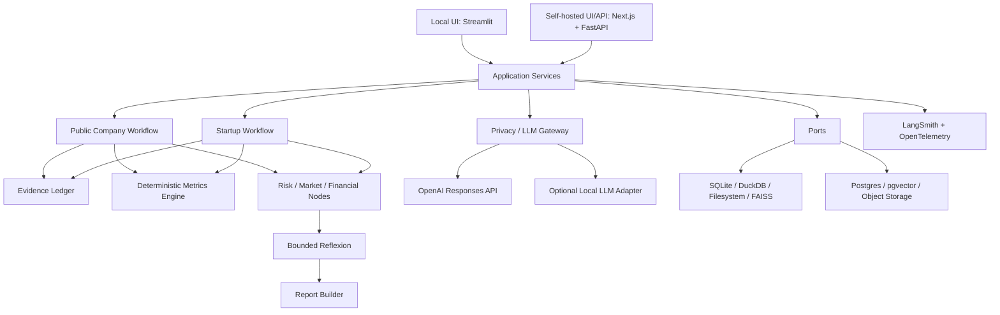
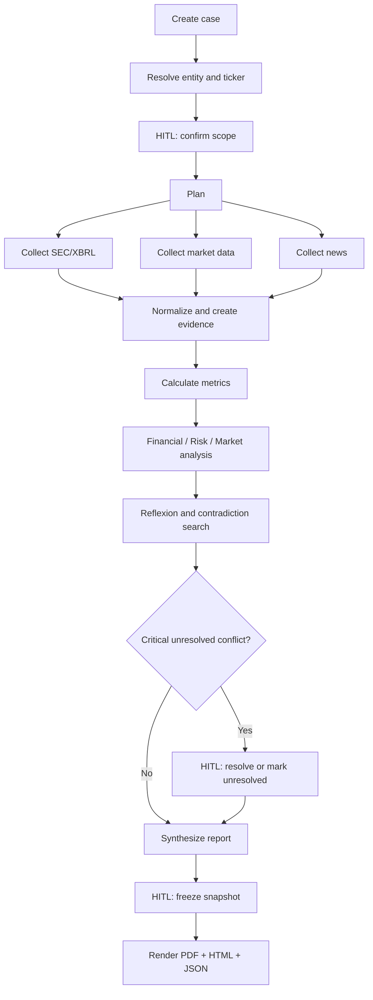
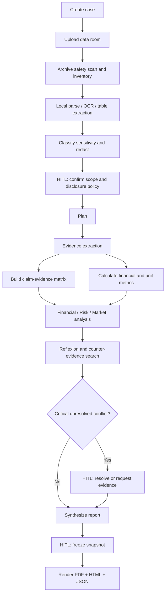
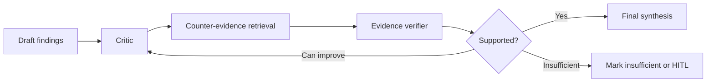

# Investment Due Diligence Agent

## Design Specification

| Поле | Значение |
|---|---|
| Проект | Capstone N3 |
| Направление | Vertical AI & Industry Solutions — FinTech & Investments |
| Статус | Продуктовый и архитектурный дизайн утверждён пользователем; library-level defaults проходят smoke-validation при планировании реализации |
| Дата | 2026-08-09 |
| Архитектурный стиль | Modular Monolith + Ports and Adapters |
| Режимы | Public Company Mode и Startup Mode |
| Последовательность поставки | Local-first, затем Self-hosted |

## 1. Резюме решения

Система выполняет воспроизводимый экспресс-анализ публичной компании или стартапа перед инвестиционным решением. Она собирает и нормализует данные, рассчитывает финансовые метрики детерминированным кодом, строит выводы только поверх доказательств, ищет противоречия через ограниченную Reflexion-петлю и формирует версионированный PDF-отчёт вместе с машиночитаемым Report JSON.

Ключевое отличие продукта от обычного LLM-чата — доказательная модель:

- каждое существенное утверждение связано с источником, расчётом или явной отметкой о нехватке данных;
- модель не выполняет арифметику, если расчёт можно выразить детерминированной формулой;
- сырые документы Startup Mode обрабатываются локально;
- внешнему LLM разрешены только минимальные очищенные фрагменты через единый Privacy/LLM Gateway;
- LangSmith используется для AI-tracing, OpenTelemetry — для application и infrastructure tracing;
- критические противоречия и финальная заморозка отчёта проходят Human-in-the-loop.

## 2. Источники требований и границы

Основным источником требований является описание проекта, предоставленное пользователем в чате, и последовательно утверждённые проектные решения. Внешняя страница Notion не стала источником истины: авторизация Notion MCP завершалась ошибкой HTTP 403, поэтому содержимое, которое не было вставлено пользователем в чат, не считается прочитанным или утверждённым.

### 2.1 Входит в продукт

- анализ публичной компании по ticker;
- загрузка полного startup data room;
- локальный parsing, OCR, нормализация и индексирование документов;
- сбор SEC filings, рыночных данных и новостей;
- детерминированные финансовые и unit-economics расчёты;
- Evidence Ledger и claim–evidence matrix;
- Plan-and-Execute workflow;
- ограниченная Reflexion-петля;
- risk, financial и market analysis как специализированные узлы графа;
- tracing, evaluation и privacy audit;
- интерактивные графики в UI;
- PDF, HTML и Report JSON;
- локальный профиль запуска и последующий self-hosted профиль.

### 2.2 Не входит в MVP

- автоматическое совершение сделок;
- персональная инвестиционная рекомендация без дисклеймера и человеческого решения;
- юридическое заключение;
- полноценная VDR-система с внешним обменом документами;
- обучение собственной foundation model;
- обработка социальных сетей как обязательного первичного источника;
- микросервисная архитектура;
- автономные сетевые multi-agent процессы с отдельными хранилищами состояния.

Под «полным startup data room» здесь понимается read-only ingest набора файлов для анализа. Продукт не предоставляет совместное редактирование, внешнюю раздачу ссылок, granular permissions, document negotiation, e-signature или другие функции Virtual Data Room.

Настоящий документ является umbrella architecture specification. Он фиксирует оба требуемых продуктовых режима, но не означает их одновременную реализацию одним неделимым change set. Implementation plans создаются для отдельных вертикальных срезов в порядке, определённом в разделе 29.

## 3. Цели и критерии успеха

### 3.1 Продуктовые цели

1. Сократить первичный due diligence с ручного многодневного просмотра до управляемого анализа, который можно выполнить и проверить за один рабочий сеанс.
2. Отделить факты, расчёты, выводы модели и недостающие данные.
3. Не скрывать противоречия между документами и источниками.
4. Обеспечить воспроизводимость отчёта через версии данных, графа, промптов и моделей.
5. Не раскрывать сырой startup data room внешним AI-провайдерам.

### 3.2 Технические цели

- отказ одного некритичного источника не уничтожает весь кейс;
- критические расчёты повторяемы без LLM;
- каждый узел workflow трассируется;
- любой внешний AI-вызов проходит единый privacy-контроль;
- каждый Report Snapshot неизменяем;
- локальная версия не зависит от self-hosted инфраструктуры;
- переход к серверному развертыванию не меняет domain и application contracts.

### 3.3 Определение критического вывода

`Critical finding` — finding уровня `HIGH` или `CRITICAL`, вывод Executive Summary либо утверждение, которое способно существенно изменить инвестиционную гипотезу, valuation, runway, solvency или решение о продолжении due diligence. Для него действуют максимальные требования к evidence coverage, contradiction handling и HITL.

## 4. Пользовательские режимы

### 4.1 Public Company Mode

Вход:

- ticker;
- биржа или юрисдикция при неоднозначности;
- период анализа;
- валюта отчёта;
- опциональные дополнительные документы.

Обязательные источники и задачи:

- SEC EDGAR submissions, filings и XBRL Company Facts для SEC-reporting issuers;
- рыночные цены и базовые market metadata через сменный адаптер;
- новости и события за заданный период;
- нормализация финансовых периодов и единиц;
- расчёт трендов, маржинальности, ликвидности, долговой нагрузки, cash flow и valuation;
- извлечение material risks и значимых изменений между filings;
- summary новостного покрытия и простая polarity label как вторичный сигнал, без social-media analytics;
- фиксация даты среза `as_of`.

Stage 1 поддерживает только SEC-reporting issuers. Не-SEC issuer получает статус `unsupported_jurisdiction`; подключение юрисдикционных filing adapters относится к Stage 4.

SEC и официальная отчётность имеют более высокий evidence priority, чем агрегаторы. SEC adapter обязан использовать объявленный `User-Agent`, cache и fair-access rate limit не выше опубликованного SEC лимита. `yfinance` — необязательный research/demo convenience adapter: он не является source of record, не требуется для acceptance и не может быть единственным доказательством критической цифры. Production profile требует лицензированного market-data provider.

### 4.2 Startup Mode

Вход — полный data room:

- PDF;
- XLSX и CSV;
- DOCX;
- PNG, JPEG и другие поддержанные изображения;
- ZIP с допустимыми типами файлов.

Система анализирует:

- pitch deck и investment memo;
- P&L, cash flow и balance-like таблицы;
- customer или cohort exports;
- unit economics;
- cap table, если предоставлен;
- договоры и корпоративные документы на уровне risk signals, а не юридического заключения;
- product, market, competition, team и governance claims;
- согласованность заявлений между deck, финансовой моделью и фактическими таблицами.

Для каждого значимого заявления строится claim–evidence matrix со статусом:

- `verified`;
- `partially_verified`;
- `contradicted`;
- `unsupported`;
- `insufficient_data`.

Безопасные значения ingest по умолчанию:

- не более 100 файлов на кейс;
- не более 250 MB на отдельный файл;
- не более 1 GB суммарного распакованного объёма;
- глубина вложенных архивов — не более 2;
- decompression ratio — не более 100:1;
- только allowlisted MIME types после content sniffing.

Лимиты конфигурируются для self-hosted deployment, но не могут быть отключены полностью.

## 5. Рассмотренные архитектурные подходы

### 5.1 Выбранный: modular monolith с ports and adapters

Преимущества:

- достаточная изоляция домена, workflow и интеграций;
- простой локальный запуск;
- меньше инфраструктуры и точек отказа;
- удобное тестирование адаптеров контрактными тестами;
- миграция SQLite/FAISS/filesystem на Postgres/pgvector/object storage без переписывания бизнес-логики;
- возможность позднее вынести тяжёлые операции в workers.

### 5.2 Отклонённый для MVP: сразу microservices

Подходит для большого количества команд и независимого масштабирования, но преждевременно добавляет service discovery, distributed tracing, очереди, сетевые контракты и сложность развертывания.

### 5.3 Отклонённый для MVP: полностью автономный multi-agent консилиум

Отдельные Financial, Risk и Market агенты полезны в зрелой системе, но на старте увеличивают стоимость, недетерминизм и сложность отладки. В MVP эти роли реализуются как изолированные LangGraph nodes с общим состоянием и Evidence Ledger. Их можно вынести в отдельных агентов без изменения domain contracts после накопления eval-данных.

## 6. Архитектура верхнего уровня



Зависимости направлены внутрь: adapters зависят от ports, application зависит от domain, но domain не знает о Streamlit, SEC, OpenAI, LangSmith или конкретной базе данных.

## 7. Профили развертывания

### 7.1 Local-first

Целевой профиль первой поставки:

- Python 3.12 или 3.13 virtual environment; точная версия фиксируется lockfile после Windows/Linux dependency smoke-test;
- Streamlit UI;
- один application process;
- SQLite для metadata и workflow checkpoints;
- DuckDB для локальной аналитики таблиц;
- filesystem для исходных и производных artifacts;
- FAISS для локального vector search;
- локальные parsers, OCR и PII redaction;
- внешние API только через adapters и policy gateway;
- versioned local cache для embedding/OCR/parser model artifacts и offline mode без скрытых runtime downloads;
- Chrome/Chromium используется Kaleido только при наличии; без него static charts рендерятся Matplotlib adapter;
- HTML/PDF/JSON сохраняются в каталоге кейса.

### 7.2 Self-hosted

Второй профиль использует те же application и domain modules:

- Next.js UI;
- FastAPI API;
- Postgres для metadata, workflow state и audit records;
- pgvector для embeddings;
- MinIO или совместимое S3 object storage;
- background workers для parsing, OCR, collection и report rendering;
- OIDC и RBAC;
- OpenTelemetry Collector;
- Grafana stack: Tempo для traces, Prometheus для metrics, Loki для logs и Grafana для dashboards.

Выбор конкретной библиотеки очередей является deployment detail за `JobQueuePort` и не изменяет настоящий дизайн.

## 8. Технологический стек

| Область | Технология | Назначение |
|---|---|---|
| Язык | Python 3.12/3.13 + lockfile | Основной backend; точная версия подтверждается dependency smoke-test и CI |
| Workflow | LangGraph | Plan-and-Execute, checkpoints, ветвление, retries, HITL и bounded loops |
| LLM API | OpenAI Python SDK + Responses API | Structured reasoning и tool-oriented model calls |
| Model routing | `ModelRoutingPolicy` над LLM adapters | OpenAI profile по умолчанию: GPT-5.6 Terra для обычных задач, GPT-5.6 Sol для сложной проверки и арбитража |
| Python analysis | Versioned Metric Engine + optional OpenAI Code Interpreter adapter | Канонические расчёты локальны; hosted interpreter разрешён только для public/approved sanitized data и его результат повторно проверяется локально |
| Contracts | Pydantic | Строгие входные и выходные схемы узлов и LLM |
| AI tracing | LangSmith adapter | Primary AI-tracing UI при включённом безопасном export; только sanitized metadata |
| App tracing | OpenTelemetry | Vendor-neutral traces, metrics и корреляция сервисов |
| Evaluation | pytest + golden fixtures + Ragas + custom evaluators | Проверка фактов, retrieval, citation coverage и регрессий |
| Dataframes | Pandas | Совместимая табличная обработка; тяжёлые локальные запросы делегируются DuckDB |
| Local analytics | DuckDB | SQL-анализ XLSX/CSV-derived tables и snapshots |
| Metadata local | SQLite | Cases, state, approvals и audit metadata |
| Metadata server | PostgreSQL | Multi-user self-hosted storage |
| Vector search local | sentence-transformers + FAISS | Локальный multilingual RAG |
| Vector search server | pgvector | Self-hosted semantic retrieval |
| Document conversion | Docling adapter | Структура PDF/DOCX и таблицы |
| PDF parsing fallback | PyMuPDF + pdfplumber | Текст, страницы, координаты и резервное извлечение таблиц |
| Office files | openpyxl, python-docx | XLSX и DOCX |
| OCR | Tesseract/OCR adapter | Локальное распознавание сканов и изображений |
| PII redaction | Microsoft Presidio + deterministic rules | Поиск и маскирование чувствительных данных |
| HTTP | httpx | Async clients, timeout, retry и connection pooling |
| Public data | SEC EDGAR REST/XBRL adapters | Первичные filings и company facts |
| Market data | optional yfinance demo adapter | Research-only convenience; production использует лицензированный provider |
| News | RSS/GDELT/public-source discovery adapter | URL, metadata и snippets; full text сохраняется только при явно разрешающей лицензии |
| UI local | Streamlit | Быстрый локальный аналитический интерфейс |
| API server | FastAPI | Self-hosted HTTP API |
| UI server | Next.js | Self-hosted multi-user frontend |
| Charts | Plotly + Kaleido; Matplotlib fallback | Интерактивные графики; static render через Chrome/Chromium либо Matplotlib |
| Reports | Jinja2 + server-owned HTML/CSS + WeasyPrint adapter | Структурированный PDF через канонический безопасный HTML |
| PDF rendering fallback | ReportLab adapter | Резервный локальный renderer |

Модель embeddings выбирается конфигурацией local embedding adapter. Базовый multilingual профиль — `BAAI/bge-m3` при достаточном железе; CPU-friendly fallback — `intfloat/multilingual-e5-base`. Модели embeddings, OCR и document conversion загружаются только на этапе setup в allowlisted versioned cache. Для каждого artifact фиксируются hash, версия, license и model-card URL; Startup runtime поддерживает no-network parser mode.

Library-level строки таблицы являются рекомендуемыми adapter defaults, а не domain invariants. Implementation plan обязан зафиксировать версии в lockfile, проверить установку на Windows и Linux и заменить несовместимый adapter без изменения ports.

## 9. Модульные границы

```text
src/
  domain/
    cases/
    artifacts/
    evidence/
    metrics/
    findings/
    reports/
  application/
    commands/
    queries/
    services/
    policies/
  workflows/
    public_company/
    startup/
    shared/
  ports/
    repositories/
    collectors/
    parsers/
    llm/
    tracing/
    rendering/
    jobs/
  adapters/
    local_storage/
    server_storage/
    sec/
    market_data/
    news/
    documents/
    openai/
    observability/
    reports/
  presentation/
    streamlit/
    api/
  bootstrap/
```

### 9.1 Domain

Содержит entities, value objects, invariants, формулы и статусы. Не импортирует LangGraph, Streamlit, OpenAI SDK или storage clients.

### 9.2 Application

Реализует use cases: создание кейса, запуск анализа, approval, повтор узла, заморозка snapshot и экспорт отчёта. Оркестрирует ports и domain services.

### 9.3 Workflows

Содержит LangGraph graph definitions и node orchestration. Public Company и Startup workflows разделены, но используют общие узлы evidence, calculations, risk, Reflexion и report synthesis.

### 9.4 Ports

Определяют стабильные протоколы для collectors, parsers, repositories, LLM, tracing, rendering и background jobs.

### 9.5 Adapters

Реализуют конкретные технологии. Ни один workflow node не вызывает OpenAI, SEC, yfinance или файловую систему напрямую.

## 10. Ключевые доменные сущности

### 10.1 `DueDiligenceCase`

Хранит:

- `case_id`;
- режим;
- entity identity;
- scope и период;
- base currency;
- privacy policy;
- budget policy;
- status;
- timestamps;
- активную версию workflow.

### 10.2 `Artifact`

Представляет документ, таблицу, filing, news item или производный файл:

- content hash;
- MIME type;
- source;
- source URL и normalized query parameters;
- `retrieved_at`;
- `published_at`, `filing_acceptance_at` или другой domain-specific effective timestamp;
- immutable source snapshot hash;
- local storage reference;
- parsing status;
- sensitivity class;
- lineage к исходному artifact.

### 10.3 `EvidenceFact`

Атомарный факт с provenance:

- нормализованное значение;
- тип и единица;
- период;
- source priority;
- artifact/page/cell locator;
- extraction method;
- confidence;
- supporting text hash;
- sensitivity class;
- inherited source freshness metadata.

### 10.4 `Calculation`

Детерминированный результат:

- metric name;
- formula version;
- входные `EvidenceFact IDs`;
- значение, единица и период;
- warnings;
- calculation timestamp.

### 10.5 `Finding`

Аналитический вывод:

- category;
- severity;
- concise claim;
- evidence и calculation references;
- confidence;
- status;
- counter-evidence references;
- author node/model metadata.

### 10.6 `Contradiction`

Связывает несовместимые facts или claims, объясняет тип конфликта и хранит resolution status.

### 10.7 `Approval`

Фиксирует HITL gate, действие пользователя, comment, actor, timestamp и версию данных.

### 10.8 `ReportSnapshot`

Неизменяемая версия отчёта:

- report hash;
- case snapshot;
- source hashes и `as_of`;
- graph, prompt, formula и model versions;
- trace IDs;
- HTML, PDF и JSON artifact references;
- `ReproducibilityManifest`.

`ReproducibilityManifest` включает code commit/build ID, dependency lock hash, Python и package versions, provider/model ID и разрешённый snapshot/alias, reasoning parameters, adapter versions, parser/OCR versions, embedding model/index version, redaction-policy version, locale/timezone, FX source, deterministic seeds и конфигурационный hash без secrets.

## 11. Evidence Ledger

Evidence Ledger — центральный слой истины. Он отделяет исходные факты от интерпретации модели.

Правила:

1. У факта всегда есть provenance.
2. Критическая цифра без периода и единицы считается неполной.
3. Повторное извлечение не перезаписывает факт без истории версий.
4. Конфликтующие факты сосуществуют до разрешения.
5. Source priority не устраняет конфликт автоматически, а влияет на recommended resolution.
6. LLM не создаёт `EvidenceFact` без locator к доступному источнику.
7. Сводный вывод хранит только IDs доказательств, а не копию исходного текста.

Приоритет источников по умолчанию:

```text
official filing / signed source document
  > audited or system-exported table
  > management-provided narrative
  > licensed market/news metadata or rights-cleared content
  > secondary aggregator
  > model inference
```

News evidence используется для narrative/event claims, но не заменяет первичный источник финансового факта. Discovery adapters сохраняют URL, publisher, title, snippet, `published_at`, retrieval metadata и response hash. Полный текст статьи хранится или воспроизводится только тогда, когда лицензия источника явно это разрешает.

## 12. Детерминированные финансовые метрики

Все формулы регистрируются в versioned `MetricDefinition` и выполняются Python-кодом. LLM может объяснять результат, но не менять вычисленное значение.

### 12.1 Public company metrics

- revenue growth = `revenue_current / revenue_previous - 1`;
- gross margin = `gross_profit / revenue`;
- operating margin = `operating_income / revenue`;
- net margin = `net_income / revenue`;
- free cash flow = `cash_from_operations - capital_expenditures`;
- net debt = `total_debt - cash_and_equivalents`;
- current ratio = `current_assets / current_liabilities`;
- interest coverage = `EBIT / interest_expense`, если входные данные сопоставимы;
- EV/Sales, EV/EBITDA и P/E только при валидных denominator и market snapshot;
- dilution и share-count trend;
- cash conversion и working-capital trend.

### 12.2 Startup metrics

- MRR и ARR;
- period-over-period growth;
- gross margin;
- net burn;
- runway months = `available_cash / normalized_monthly_net_burn`;
- CAC;
- LTV и LTV/CAC только при явно указанной модели LTV;
- CAC payback;
- logo и revenue churn;
- NRR;
- burn multiple;
- Rule of 40 только для подходящей стадии и модели бизнеса;
- cohort retention при наличии cohort-level данных.

Система обязана показывать формулу, входные факты, единицы, период и предупреждение, если сравниваются несопоставимые данные.

### 12.3 Python calculation и Code Interpreter

Канонический `MetricEngine` выполняет зарегистрированные Python-функции локально и сохраняет calculation artifact: версию функции, входные IDs, нормализованные значения, результат, warnings и environment hash.

OpenAI Code Interpreter adapter может использоваться для exploratory анализа публичных либо явно одобренных и очищенных данных. Он не получает raw Startup artifacts или `RESTRICTED` данные. Его код и outputs сохраняются как provisional artifacts, а любые числа, попадающие в findings или report, повторно рассчитываются либо проверяются локальным `MetricEngine`. Таким образом, Code Interpreter расширяет исследование, но не становится источником истины.

## 13. Public Company Workflow



Граф выполняет независимые collectors параллельно, но downstream calculations запускаются только после нормализации требуемых входов.

## 14. Startup Workflow



ZIP ingest защищается от zip-slip, archive bombs, вложенных архивов сверх лимита, неподдерживаемых MIME types и превышения quota. Подозрительный файл помещается в quarantine и не останавливает остальные artifacts.

## 15. Plan-and-Execute

Planner создаёт типизированный `AnalysisPlan`:

- objectives;
- required sources;
- required metrics;
- specialist tasks;
- dependencies;
- budget limits;
- stop conditions;
- expected output schemas.

Executor выполняет только допустимые типы задач. План может быть уточнён при отсутствии источника, но:

- не может расширить privacy policy;
- не может снять HITL gate;
- не может превысить model/token budget;
- не может превратить secondary source в primary evidence;
- не может создавать бесконечные подзадачи.

## 16. AI и model routing

### 16.1 Роли моделей

Роли определяются capability class, а конкретные model IDs живут в adapter configuration. Утверждённый OpenAI profile по умолчанию:

- GPT-5.6 Terra — default structured extraction/analysis model;
- GPT-5.6 Sol — high-reasoning verifier/arbiter для сложных противоречий и высокорисковых выводов.
- Local LLM adapter — опциональный путь для фрагментов, которые privacy policy запрещает отправлять наружу. Если качество local model недостаточно, система создаёт HITL item вместо скрытого внешнего вызова.

Model selection определяется `ModelRoutingPolicy` по:

- сложности задачи;
- sensitivity class;
- стоимости;
- latency budget;
- результатам предыдущей schema validation;
- severity потенциального finding.

### 16.2 Structured outputs

Каждый LLM node получает минимальный task-specific context и возвращает Pydantic schema. Свободный текст модели не записывается в domain напрямую.

Обязательные правила:

- поле evidence IDs для каждого существенного claim;
- `confidence` не заменяет доказательство;
- неизвестное значение возвращается как `null` плюс reason, а не выдумывается;
- schema repair допускается один раз;
- prompt и schema имеют версии;
- модель не видит секреты provider configuration.

## 17. Privacy-first обработка

### 17.1 Центральный Privacy/LLM Gateway и Data Egress Policy

Ни один graph node не вызывает внешний LLM напрямую. Gateway выполняет:

1. policy check;
2. sensitivity classification;
3. минимизацию контекста;
4. PII и secret redaction;
5. allow/deny decision;
6. disclosure audit;
7. model routing;
8. response schema validation;
9. безопасную запись trace metadata.

Общий `DataEgressPolicy` применяется не только к LLM, но и к external tracing, hosted embeddings/file search/code tools, model hubs и любому другому network egress. Ни один adapter не может считать отсутствие явного запрета разрешением на передачу данных.

### 17.2 Классы данных

- `PUBLIC` — публичные filings, официальные страницы и новости;
- `INTERNAL` — непубличные бизнес-материалы без прямых identifiers;
- `CONFIDENTIAL` — финансовые модели, customer data, договоры и cap table;
- `RESTRICTED` — PII, банковские реквизиты, credentials, персональные и особо чувствительные данные.

`RESTRICTED` не отправляется внешнему провайдеру. `CONFIDENTIAL` разрешён только после редактирования, минимизации и Gate 2 approval. Raw artifacts остаются локально или в self-hosted object storage.

Правила классификации:

- highest sensitivity wins для документа, таблицы или fragment, пока не выполнена более точная field/cell-level классификация;
- производные данные наследуют максимальную sensitivity входов;
- агрегирование снижает класс только после отдельной re-identification проверки;
- mixed таблицы маркируются на уровне полей/ячеек, но внешний fragment получает максимальный класс включённых значений;
- `RESTRICTED` нельзя понизить простой заменой имени, если сочетание остальных полей позволяет повторную идентификацию.

Default policy:

- Public Company Mode разрешает external LLM и sanitized LangSmith export для `PUBLIC` данных;
- Startup Mode запрещает prompt/output capture, external tracing content и передачу raw artifacts по умолчанию;
- после Gate 2 внешний LLM может получить только минимальные redacted snippets класса не выше разрешённого `CONFIDENTIAL`;
- любое новое повышение sensitivity требует повторной policy evaluation.

### 17.3 Security controls

- content-addressed artifact storage;
- MIME sniffing вместо доверия расширению;
- ограничения размера и decompression ratio;
- quarantine;
- per-case retention policy;
- encryption in transit для self-hosted;
- encryption at rest средствами платформы;
- OIDC/RBAC для server profile;
- append-only audit events;
- secrets только через environment/secret store, не в repository и traces;
- WeasyPrint получает только server-owned Jinja templates и sanitized values; untrusted HTML/CSS и внешние URL запрещены;
- renderer version фиксируется в `ReproducibilityManifest`, а security release проверяется при dependency lock.

## 18. Reflexion и fact checking



Ограничения:

- максимум две итерации;
- итерация должна добавить новое evidence или изменить status;
- при отсутствии прогресса цикл останавливается;
- критик не изменяет исходные facts и calculations;
- противоречия сохраняются отдельными entities;
- high-severity unsupported finding не может попасть в Executive Summary как установленный факт.

## 19. Human-in-the-loop

### Gate 1 — Scope confirmation

Пользователь подтверждает entity, ticker, режим, период, валюту и набор документов.

### Gate 2 — Disclosure policy

В Startup Mode пользователь видит preview категорий очищаемых данных и подтверждает допустимую политику внешней передачи. Повторное подтверждение требуется при появлении нового sensitivity class, а не перед каждым однотипным вызовом.

### Gate 3 — Critical contradictions

Пользователь может:

- принять приоритетный источник;
- исключить недостоверный artifact;
- запросить дополнительные доказательства;
- отредактировать классификацию;
- оставить конфликт нерешённым.

Последствия решений:

- исключение artifact инвалидирует все зависимые `EvidenceFact`, `Calculation` и `Finding` и запускает пересчёт затронутой ветки;
- нерешённый критический конфликт обязательно попадает в Executive Summary и не допускает формулировку «подтверждено»;
- запрос дополнительных доказательств переводит кейс в `awaiting_evidence`;
- отклонение Gate 4 запрещает final PDF export, но позволяет сохранить явно маркированный draft HTML/JSON;
- любое изменение после freeze создаёт новый `ReportSnapshot`.

### Gate 4 — Report freeze

Пользователь подтверждает snapshot перед экспортом. После freeze исправление создаёт новую версию, а не меняет старый отчёт.

## 20. Error model

Каждый node возвращает `NodeResult[T]`:

```text
status:
  success | partial | retryable_error | blocked | failed

data_refs
warnings
errors
fallback_used
retry_after
trace_id
```

Категории ошибок:

- `TRANSIENT_EXTERNAL`;
- `SOURCE_UNAVAILABLE`;
- `INVALID_DOCUMENT`;
- `EXTRACTION_LOW_CONFIDENCE`;
- `SCHEMA_VALIDATION_ERROR`;
- `PRIVACY_POLICY_VIOLATION`;
- `CALCULATION_ERROR`;
- `EVIDENCE_CONFLICT`;
- `HUMAN_REJECTED`;
- `REPORT_RENDER_ERROR`;
- `OBSERVABILITY_EXPORT_ERROR`;
- `AUDIT_PERSISTENCE_ERROR`.

Raw exceptions не записываются в graph state. Полный stack trace разрешён только в защищённых application logs без document contents.

## 21. Retry и fallback

| Ситуация | Автоматическое поведение | Результат |
|---|---|---|
| HTTP timeout, 429 или 5xx | До 3 попыток, exponential backoff и jitter | Retryable error или fallback |
| SEC недоступен | Локальный cache с явным `as_of` | Без cached primary filing связанные financial assertions — `blocked`; только некритичные разделы могут быть `partial` |
| Market provider недоступен | Cache или альтернативный adapter | Valuation помечается partial |
| News provider недоступен | Вторичный adapter/RSS | Анализ продолжается с coverage warning |
| PDF parser не справился | Второй parser, затем OCR | Low-confidence evidence маркируется |
| Один artifact повреждён | Quarantine и продолжение остальных | Missing-data warning |
| LLM timeout | Retry, затем fallback model | Deterministic outputs сохраняются |
| LLM schema invalid | Одна repair-попытка | Fallback model или HITL |
| Privacy violation | Блокировка внешнего вызова | Local path или HITL |
| PDF render failure | Сохранить HTML и Report JSON | Повторный render без полного анализа |
| LangSmith/OTel exporter недоступен | Сохранить sanitized spans в локальном audit spool | Анализ продолжается с observability warning, если local audit цел |
| Local audit persistence недоступен | Остановить новые внешние AI-вызовы и report freeze | `AUDIT_PERSISTENCE_ERROR` и HITL |

Privacy policy и HITL gates не имеют автоматического bypass.

Любой LLM fallback повторно проходит `ModelRoutingPolicy`, `DataEgressPolicy` и Privacy/LLM Gateway. Он обязан сохранить тот же output schema, записать primary error и `fallback_used`, и не может перевести `RESTRICTED` или неразрешённый `CONFIDENTIAL` контекст с local-only пути на внешнего провайдера. После `PRIVACY_POLICY_VIOLATION` автоматический provider fallback запрещён.

## 22. Tracing и observability

### 22.1 LangSmith

LangSmith является primary AI observability UI, когда его adapter разрешён политикой кейса:

- LangGraph runs и node spans;
- prompt/model/schema versions;
- latency, tokens и estimated cost;
- retries и model fallback;
- evaluator results;
- dataset и experiment linkage;
- correlation с case и report snapshot.

Masking и minimization выполняются до создания/export LangSmith run. В Startup Mode prompt/output capture выключен по умолчанию; наружу разрешены только IDs, hashes, counts, status, versions, latency, token/cost metadata и sanitized evaluator results. Если LangSmith export отключён, те же безопасные AI spans сохраняются локально через OpenTelemetry/audit adapter.

### 22.2 OpenTelemetry

OpenTelemetry покрывает:

- HTTP requests;
- collectors и parsers;
- database и object storage calls;
- job execution;
- report rendering;
- application errors;
- self-hosted service boundaries.

Один correlation ID связывает LangSmith run, OTel trace, case и ReportSnapshot.

### 22.3 Надёжность telemetry

- sanitized local audit event обязан сохраниться до внешнего export;
- external exporter работает асинхронно через bounded spool;
- exporter outage не блокирует analysis, если local audit persistence исправен;
- report показывает `observability_degraded`, пока spans не экспортированы;
- failure local audit persistence блокирует новые external AI calls и Gate 4;
- retry telemetry не содержит document payload и имеет конечный лимит;
- self-hosted policy может требовать успешный export в approved internal collector перед freeze.

### 22.4 Разрешённые trace attributes

- `case_id`;
- `node_name`;
- provider и model;
- prompt/schema/graph version;
- token counts;
- latency;
- estimated cost;
- number of evidence inputs;
- status/error code;
- fallback marker;
- Reflexion iteration count;
- artifact/evidence IDs и hashes.

Также фиксируются adapter version, redaction-policy version, retrieval/index version и hashed configuration profile.

### 22.5 Запрещённое содержимое traces

- полный текст документов;
- сырые confidential prompts;
- полные model outputs с PII;
- таблицы data room;
- имена, email, телефоны, реквизиты;
- credentials и authorization headers.

Запрет распространяется также на tool arguments/results, retrieved chunks, system instructions и exception messages, если они не прошли явную sanitization.

## 23. Evaluation

Evaluation состоит из offline regression suite и опциональных live smoke tests.

### 23.1 Offline datasets

- `public_us_frozen_v1`: один SEC-reporting issuer, замороженные 10-K/10-Q, XBRL facts, market snapshot и минимум пять news metadata records;
- `startup_synthetic_saas_v1`: deck PDF, financial XLSX, customer CSV, DOCX, scanned image, ZIP и один повреждённый файл;
- четыре planted critical contradictions: ARR, gross margin, runway и customer-count mismatch;
- `document_parsing_v1`: минимум 12 representative pages/tables/images с gold locators и values;
- `privacy_v1`: минимум 25 fragments с PII, banking fields, credentials-like strings, mixed-sensitivity tables и re-identification cases;
- Report JSON/PDF structural golden snapshots.

### 23.2 Evaluators

- schema validity;
- evidence/citation coverage;
- retrieval relevance;
- unsupported-claim rate;
- planted contradiction detection;
- numerical accuracy;
- unit/period consistency;
- privacy leakage;
- bounded-loop compliance;
- required report section coverage;
- latency и token budget.

Ragas применяется только к retrieval и evidence-grounding задачам, где его метрики уместны. Финансовую корректность проверяют custom deterministic evaluators, а не LLM-as-judge.

### 23.3 Blocking thresholds

| Метрика | Набор/формула | Порог MVP |
|---|---|---|
| Schema validity | Все offline LLM-node fixtures после не более одной repair-попытки | 100% |
| Critical evidence coverage | Critical findings с source/calculation либо `insufficient_data` | 100% |
| Unsupported critical claim rate | Critical claims без допустимого evidence status | 0% |
| Numerical accuracy | Golden calculations; `Decimal` intermediate tolerance `1e-6`, display rounding по metric definition | 100% pass |
| Contradiction recall | Четыре planted critical conflicts | 100% |
| Contradiction precision | Labeled contradiction set | Не ниже 0.80 |
| Retrieval recall@5 | Не менее 20 labeled evidence queries на каждый режим | Не ниже 0.90 |
| OCR safety | Gold key values | Значение верно либо явно low-confidence/HITL; 0 неверно подтверждённых значений |
| Privacy leakage | Exact/normalized secret and PII matching во всех trace snapshots | 0 leaks |
| Trace completeness | Завершённые graph nodes со status/duration/local audit event | 100% |
| Reflexion bound | Все graph fixtures | Не более 2 итераций |
| Budget adherence | Configured hard token/cost budget | Workflow не начинает вызов, который превысит limit |
| Offline latency | Cached-model reference machine, без времени ожидания HITL | Public ≤15 min; Startup ≤30 min |
| Report completeness | Required JSON/HTML/PDF sections и disclaimer | 100% |

Reference machine, dependency lock, fixture hashes и measurement command фиксируются вместе с eval result. Live network latency не является blocking acceptance metric.

## 24. Report contract

Канонический результат — versioned Report JSON. HTML и PDF являются renderings этого snapshot. Все перечисленные общие разделы обязательны для MVP; mode-specific разделы обязательны, кроме явно условных данных вроде cap table.

### 24.1 Общие разделы

1. Метаданные кейса, `as_of`, версия и trace ID.
2. Executive Summary.
3. Инвестиционная гипотеза и контргипотеза.
4. Профиль компании.
5. Evidence coverage и качество данных.
6. Финансовые показатели и графики.
7. Risk matrix: probability × impact × evidence.
8. Противоречия и нерешённые вопросы.
9. Недостающие данные.
10. Следующие шаги due diligence.
11. Методология, допущения и ограничения.
12. Source и calculation appendix.
13. Mandatory disclaimer и decision-owner statement.

Disclaimer явно сообщает: отчёт является инструментом аналитической поддержки; не является юридической, налоговой или персональной инвестиционной консультацией; не совершает сделок; требует решения человека; ограничен перечисленными источниками, датой среза и поддерживаемой юрисдикцией.

### 24.2 Public Company sections

- filing timeline;
- financial trends;
- capital structure;
- valuation;
- SEC risk factors и changes;
- corporate events;
- news coverage summary и простая polarity label.

### 24.3 Startup sections

- claim–evidence matrix;
- business model;
- traction;
- unit economics;
- burn и runway;
- market и competition;
- team и governance;
- cap table analysis при наличии;
- вопросы founders/management.

### 24.4 Маркировка утверждений

- `SOURCE` — прямо подтверждено;
- `CALCULATION` — получено versioned формулой;
- `INFERENCE` — аналитический вывод;
- `MISSING` — доказательств недостаточно.

Критический claim обязан иметь кликабельную ссылку на source locator в UI и явную ссылку в appendix PDF.

## 25. UI contract

Local Streamlit UI содержит:

1. New Case wizard.
2. Data Sources/Data Room inventory.
3. Workflow progress с node statuses.
4. Evidence explorer.
5. Metrics и interactive Plotly charts.
6. Findings и risk matrix.
7. Contradictions/HITL inbox.
8. Trace summary без чувствительного содержимого.
9. Report preview и export.

UI показывает разницу между:

- отсутствующими данными;
- ошибкой источника;
- низкой уверенностью extraction;
- реальным противоречием;
- неподтверждённым выводом модели.

## 26. Тестовая стратегия

### 26.1 Unit tests

- formulas;
- currency/unit/period normalization;
- PII redaction;
- source priority;
- domain invariants;
- archive safety rules.

### 26.2 Parser tests

- text PDF;
- scanned PDF;
- complex XLSX;
- CSV encodings;
- DOCX;
- images;
- damaged files;
- unsafe ZIP fixtures.

### 26.3 Contract tests

Зафиксированные responses для SEC, market data, news, embeddings и LLM adapters. Network не требуется для основного regression suite.

### 26.4 Graph tests

- happy path каждого режима;
- retry transitions;
- fallback;
- partial completion;
- HITL pause/resume;
- Reflexion stop conditions;
- checkpoint recovery;
- budget exhaustion.

### 26.5 Privacy tests

- raw PII отсутствует в LangSmith payload fixtures;
- raw document text отсутствует в OTel spans;
- restricted context блокируется gateway;
- disclosure audit создаётся для каждого разрешённого внешнего вызова.

### 26.6 End-to-end tests

1. Public company case на замороженном наборе SEC/market/news данных.
2. Synthetic startup data room с PII, конфликтующими цифрами, сканом, повреждённым документом и unsupported claim.
3. Report generation с проверкой обязательных разделов, charts, appendix и snapshot hashes.

Live API checks запускаются отдельно как manual/CI smoke suite, потому что внешние данные и rate limits нестабильны.

## 27. Критерии приёмки MVP

| Область | Критерий |
|---|---|
| Evidence coverage | 100% критических findings имеют source, calculation или `insufficient_data` |
| Calculations | 100% совпадение с golden fixtures для обязательных формул |
| Privacy | 0 raw PII/document-content leaks в trace test corpus |
| Tracing | 100% graph nodes создают status, duration и durable local audit event; exporter outage покрыт тестом |
| Reflexion | Не более двух итераций и доказуемая stop condition |
| Contradictions | 100% критических planted conflicts обнаружены в MVP golden set |
| Resilience | Один некритичный source/artifact failure не уничтожает кейс |
| Reproducibility | Каждый PDF связан с immutable Report JSON и полным `ReproducibilityManifest` |
| Reporting | Все обязательные разделы, charts, appendix и disclaimer присутствуют |
| Security | Unsafe ZIP, unsupported MIME и restricted disclosure блокируются тестами |
| Workflow recovery | Case продолжается из checkpoint после имитированного process restart |

## 28. Риски и меры контроля

| Риск | Контроль |
|---|---|
| Hallucinated claims | Evidence IDs, structured outputs, unsupported status и Reflexion |
| Ошибка LLM в арифметике | Только deterministic metrics engine |
| Несопоставимые периоды | Period normalization и calculation warnings |
| Утечка data room | Local parsing, central gateway, Presidio, trace masking и privacy tests |
| Нестабильность/лицензирование yfinance | Только optional demo use; source-of-record запрещён; production licensed provider |
| Rate limits SEC/news | Per-source rate limiter, cache, backoff и fixtures |
| Плохой OCR | Confidence score, page preview и HITL |
| Слишком дорогой анализ | Budget policy, tiered routing и token/cost traces |
| Бесконечный agent loop | Max two Reflexion iterations и graph stop conditions |
| Красивый, но непроверяемый PDF | Canonical Report JSON, source appendix и immutable snapshot |
| Преждевременная инфраструктура | Local-first modular monolith |

## 29. Последовательность поставки

### Stage 1 — Local MVP, разбитый на два implementation plan

Оба продуктовых режима обязательны, но реализуются последовательными вертикальными срезами поверх общего core.

#### Stage 1A — Foundation + Public Company vertical slice

- Public Company Mode;
- Evidence Ledger;
- public-company deterministic metrics;
- Public Company LangGraph workflow;
- Privacy/LLM Gateway и DataEgressPolicy;
- durable local audit + OpenTelemetry spans;
- sanitized LangSmith adapter;
- Streamlit UI;
- PDF/HTML/JSON report;
- `public_us_frozen_v1` evaluation suite.

#### Stage 1B — Startup vertical slice

- full read-only data-room ingest в установленных safety limits;
- PDF/XLSX/CSV/DOCX/image/ZIP adapters;
- local parsing/OCR/redaction и no-network parser mode;
- Startup LangGraph workflow;
- claim–evidence matrix;
- startup/unit-economics metrics;
- Gate 2 disclosure preview;
- `startup_synthetic_saas_v1`, parsing и privacy evaluation suites;
- Startup report sections.

### Stage 2 — Local hardening

- больше parser fixtures;
- OCR quality controls;
- expanded metrics;
- improved claim–evidence UX;
- caching, resume и budget dashboards.

### Stage 3 — Self-hosted

- FastAPI + Next.js;
- Postgres/pgvector;
- MinIO/S3;
- workers;
- OIDC/RBAC;
- OTel Collector и Grafana stack;
- multi-user audit и retention policies.

### Stage 4 — Evidence-driven extensions

Только после получения eval-данных:

- отдельный multi-agent консилиум;
- social sentiment;
- market-size research agent;
- дополнительные юрисдикции и filing systems;
- альтернативные LLM providers;
- более глубокий legal/document risk analysis.

## 30. Зафиксированные архитектурные решения

1. Поддерживаются оба режима: public company и startup.
2. Startup Mode принимает полный data room.
3. Privacy model — hybrid privacy-first.
4. Поставка — local-first, затем self-hosted.
5. Архитектура — modular monolith с ports and adapters.
6. Public и Startup workflows разделены.
7. Evidence Ledger, metrics, risk, Reflexion и reporting используются совместно.
8. LangGraph владеет orchestration и HITL.
9. Все внешние LLM-вызовы проходят Privacy/LLM Gateway.
10. LangSmith — primary AI tracing; OpenTelemetry — application/infrastructure tracing.
11. В traces не хранится raw document content или PII.
12. Финансовые расчёты детерминированы и версионируются.
13. Reflexion ограничен двумя итерациями.
14. Report JSON является каноническим результатом; PDF — его rendering.
15. Multi-agent decomposition начинается с graph nodes и не требует отдельных сервисов в MVP.

Уточнение к решению 10: LangSmith является primary AI-tracing UI только для sanitized export, разрешённого `DataEgressPolicy`. Durable local audit обязателен всегда и остаётся источником воспроизводимости при отключённом или недоступном LangSmith.

## 31. Матрица утверждённых требований

| ID | Решение | Источник | Статус | Основные разделы |
|---|---|---|---|---|
| RQ-01 | Поддержать Public Company и Startup Mode | Пользователь, Codex chat, 2026-08-09 | Approved | 4, 13, 14 |
| RQ-02 | Startup принимает полный data room | Пользователь, Codex chat, 2026-08-09 | Approved | 4.2, 14, 17 |
| RQ-03 | Hybrid privacy-first обработка | Пользователь, Codex chat, 2026-08-09 | Approved | 17, 22 |
| RQ-04 | Нужны local и self-hosted профили | Пользователь, Codex chat, 2026-08-09 | Approved | 7 |
| RQ-05 | Реализация local-first, затем self-hosted | Пользователь, Codex chat, 2026-08-09 | Approved | 29 |
| RQ-06 | Modular monolith + ports/adapters | Пользователь, Codex chat, 2026-08-09 | Approved | 5, 6, 9 |
| RQ-07 | LangGraph, model routing, tracing и evaluation stack | Пользователь, Codex chat, 2026-08-09 | Approved | 8, 15, 16, 22, 23 |
| RQ-08 | Два workflow и общий Evidence/Metric/Risk/Report core | Пользователь, Codex chat, 2026-08-09 | Approved | 9–14 |
| RQ-09 | Typed errors, bounded Reflexion, HITL, PDF и проверяемые тесты | Пользователь, Codex chat, 2026-08-09 | Approved | 18–27 |

Конкретные library versions, лицензированные market/news providers, queue implementation и local-model artifacts являются adapter-level implementation choices. Они не меняют утверждённые product/domain contracts и фиксируются соответствующим implementation plan и lockfile.

## 32. Официальные технические ссылки

- [OpenAI models](https://developers.openai.com/api/docs/models)
- [GPT-5.6 Terra](https://developers.openai.com/api/docs/models/gpt-5.6-terra)
- [GPT-5.6 Sol](https://developers.openai.com/api/docs/models/gpt-5.6-sol)
- [LangGraph observability with LangSmith](https://docs.langchain.com/oss/python/langgraph/observability)
- [LangSmith input/output masking](https://docs.langchain.com/langsmith/mask-inputs-outputs)
- [OpenTelemetry Python](https://opentelemetry.io/docs/languages/python/)
- [OpenTelemetry Generative AI semantic conventions](https://opentelemetry.io/docs/specs/semconv/registry/attributes/gen-ai/)
- [Ragas metrics overview](https://docs.ragas.io/en/latest/concepts/metrics/overview/)
- [SEC EDGAR APIs](https://www.sec.gov/search-filings/edgar-application-programming-interfaces)
- [SEC fair-access guidance](https://www.sec.gov/search-filings/edgar-search-assistance/accessing-edgar-data)
- [yfinance project notice](https://github.com/ranaroussi/yfinance)
- [NewsAPI terms](https://newsapi.org/terms)
